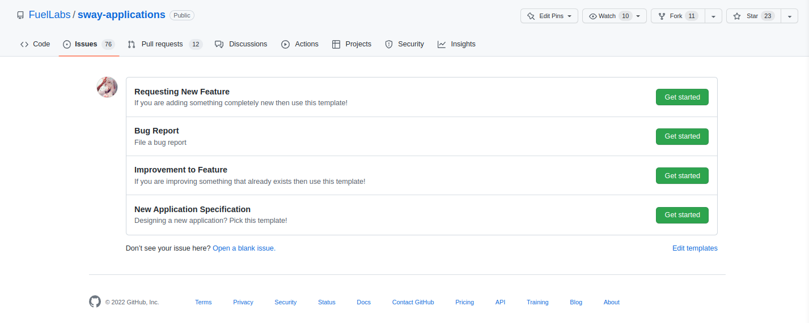

# Creating an Issue

If there is work that a project can benefit from then an issue can be filed via a template or a blank form. 

We encourage the use of the provided templates because they guide a user into answering questions that we may have. The templates are not mandatory but they provide structure for answering questions like:

- What steps can be taken to reproduce the issue?
- What feature is missing and how would you like it to work?
- Is the improvement an improvement or a personal nitpick?

 

 

The questions themselves are not that important, but what is important is providing as much detail about the task as possible. This allows other developers to come to a decision quickly and efficiently regarding the new issue.
