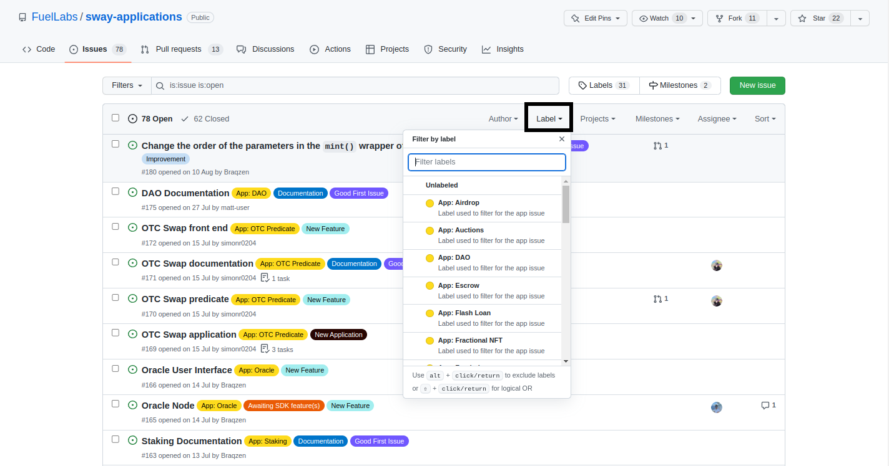
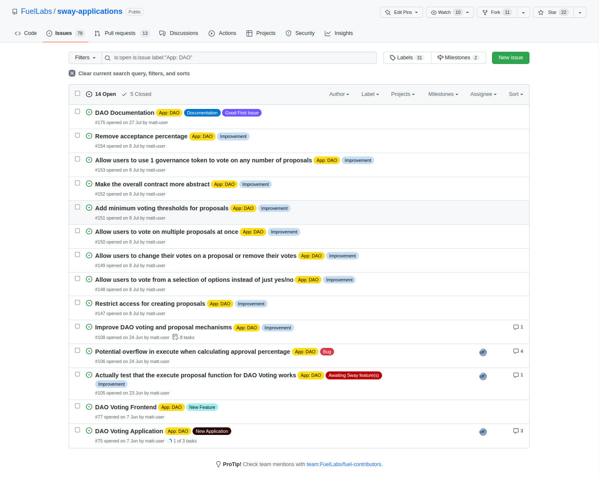

# Searching for Issues

## Filter by label

The default issues tab shows all of the issues that are currently opened. GitHub provides various search queries that can be made using the search bar however an easier way is to use the labels that the authors have provided to quickly filter for the relevant issues such as bugs, improvements, documentation etc.

Under the `Label` tab you can select any number of labels and any issue that matches those labels will be shown while the other issues will be hidden.

 

After clicking on the `App: DAO` label the issues have been filtered to show only the issues that have `App: DAO` added to them. 

Notice that `App: DAO` is not the only label in the image below. If you wish to further reduce the number of presented issues then additional labels can be added in the same way.

## Checking if anyone is working on the issue

It's important to check if anyone is currently working on an issue before starting to work on it because otherwise multiple people may be doing the same work which is an inefficient use of time.

You can check whether someone is assigned to an issue by looking under the `Assignee` tab and if there is an icon then someone is tasked with that issue. If there is no icon then it's likely that no one is currently working on that issue and you're free to assign yourself to the issue or post a comment so that an author can assign you.

## Reading the information in the ticket

You can see the activity of an issue by looking at the number of comments. This doesn't really tell you much aside from that there is a discussion about what should be done.

Clicking on the issue at the bottom `DAO Voting Application` we can see some information about the application with some tasks linked to track the overall progress. Scrolling down would present comments in this specific issue which could provide greater insight into the task.

