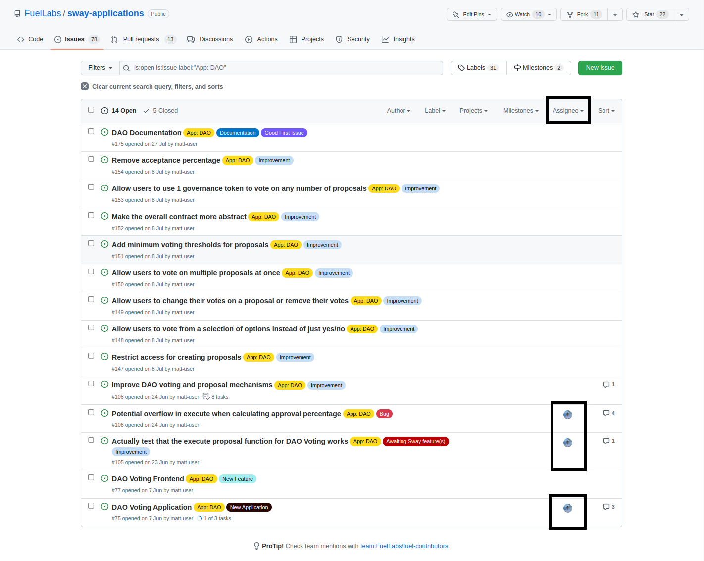

# Checking for available issues

It's important to check if anyone else is currently working on an particular issue to avoid performing duplicate work. Not only would this be frustrating but also be an inefficient use of time.

You can check whether someone is assigned to an issue by looking under the `Assignee` tab. If there is an icon, then someone is tasked with that issue. If there is no icon, then it's likely that no one is currently working on that issue and you're free to assign it to yourself or post a comment so that the author can assign you.

