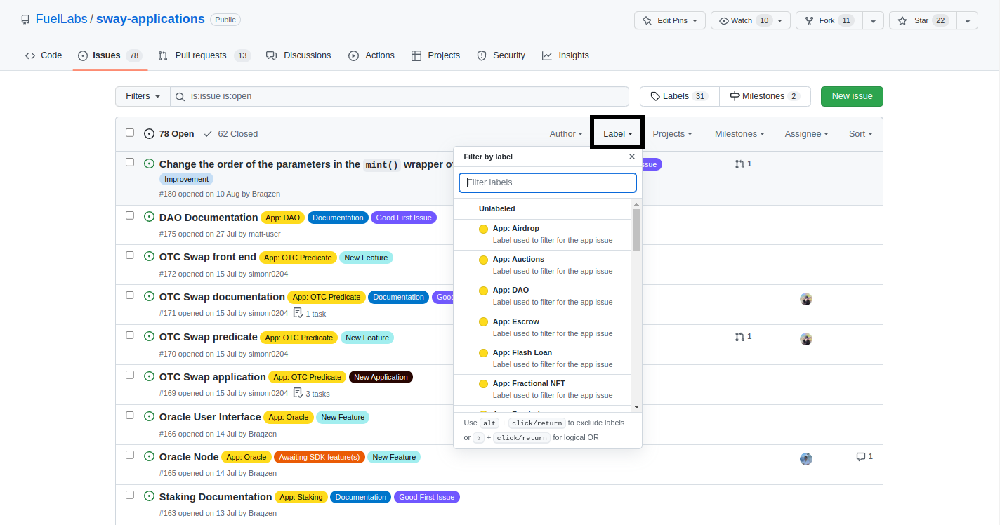
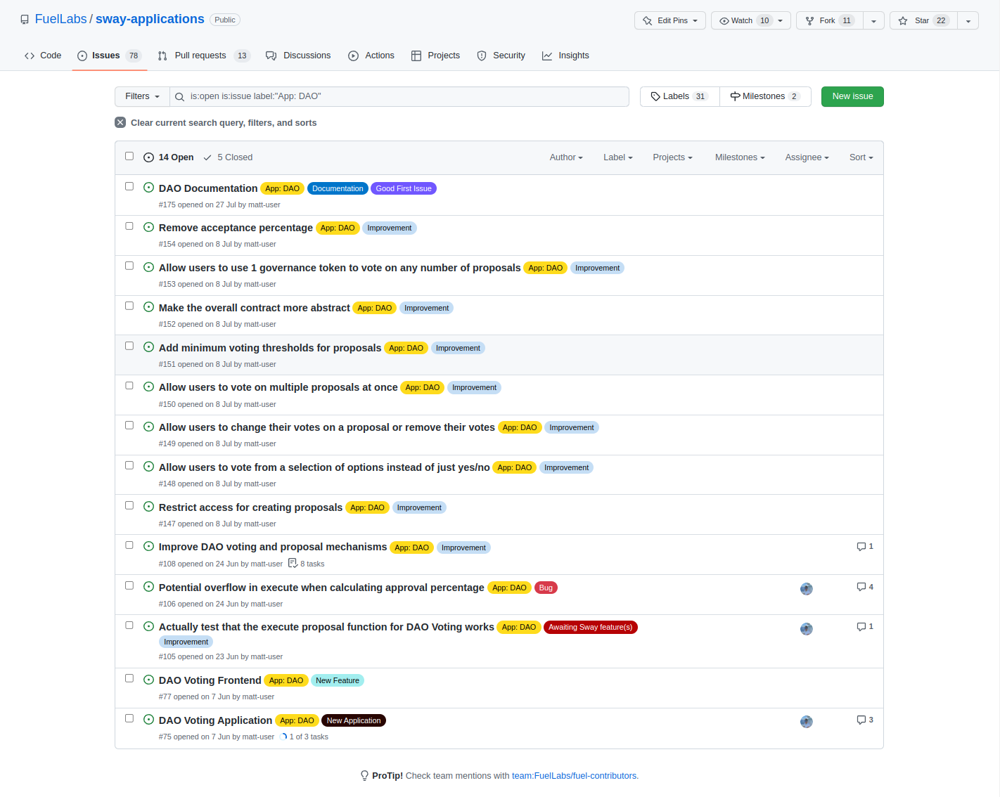

# Filtering by label

The default issues tab shows all of the issues that are currently open. GitHub already provides various search queries that can be made using the search bar. However an easier way is to use the labels that the authors have provided to quickly filter for the relevant issues such as bugs, improvements, documentation, etc.

Under the `Label` tab you can select any number of labels and any issue that matches those labels will be shown while the other issues will be hidden.

 

After clicking on the `App: DAO` label the issues have been filtered to show only the issues that have `App: DAO` added to them. 

Notice that `App: DAO` is not the only label in the image below. If you wish to further reduce the number of presented issues then additional labels can be added in the same way.

