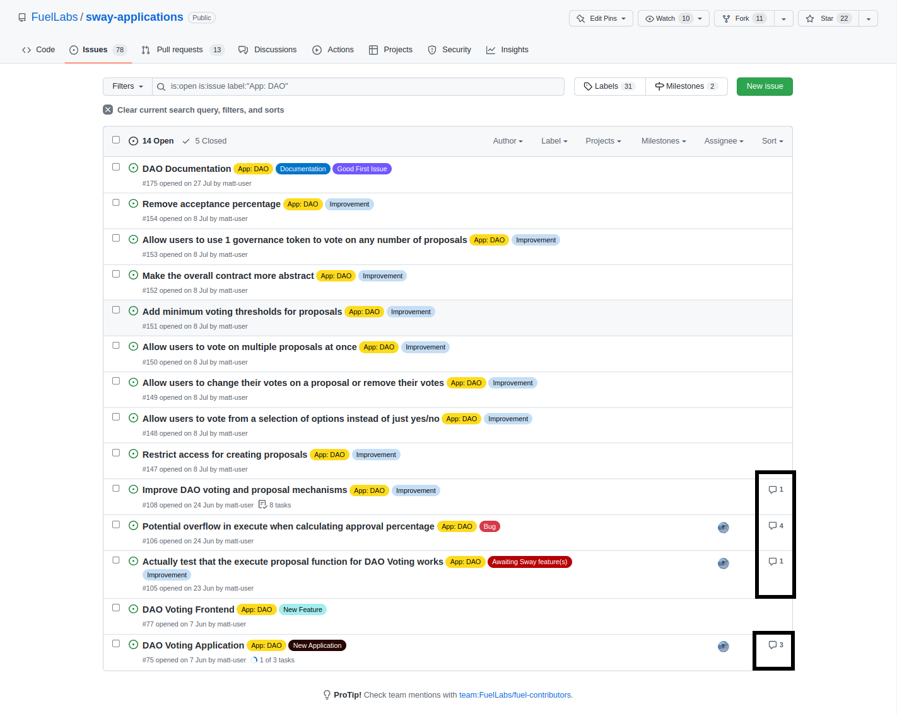
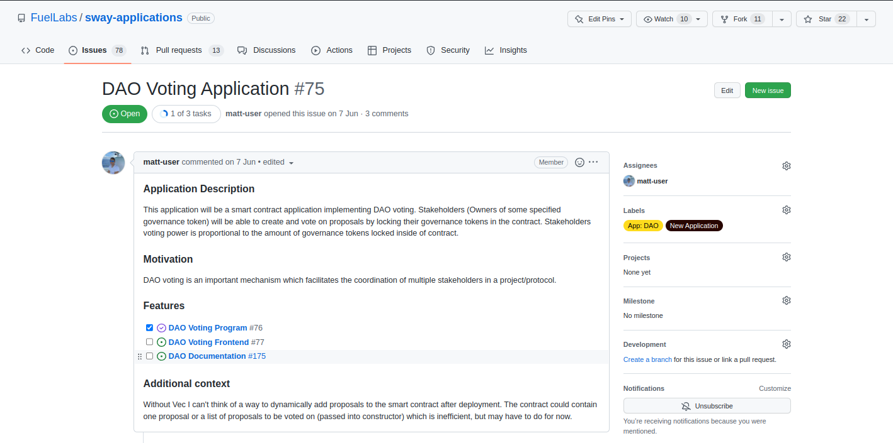

# Issue summary

You can see the activity of an issue by looking at the number of comments. This doesn't really tell you much aside from that there is a discussion about what should be done.

Clicking on the issue at the bottom `DAO Voting Application` we can see some information about the application with some tasks linked to track the overall progress. Scrolling down would present comments in this specific issue which could provide greater insight into the task.

