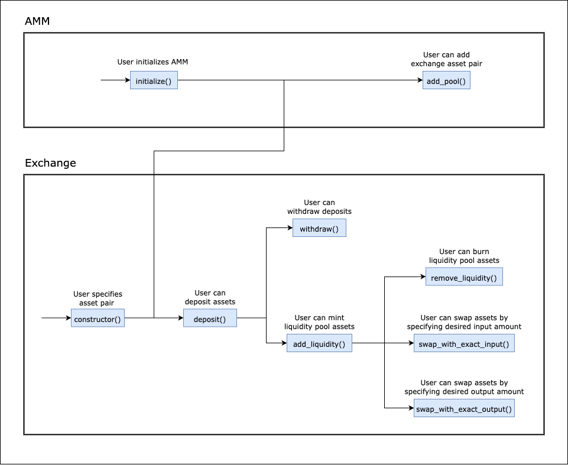

Table of Contents
- [Overview](#overview)
- [Use Cases](#use-cases)
    - [Actions that users are able to perform](#actions-that-users-are-able-to-perform)
        - [AMM Core Functionality](#amm-core-functionality)
            - [`initialize()`](#initialize)
            - [`add_pool()`](#add_pool)
        - [AMM State Checks](#amm-state-checks)
            - [`pool()`](#pool)
        - [Exchange Core Functionality](#exchange-core-functionality)
            - [`constructor()`](#constructor)
            - [`deposit()`](#deposit)
            - [`add_liquidity()`](#add_liquidity)
            - [`remove_liquidity()`](#remove_liquidity)
            - [`withdraw()`](#withdraw)
            - [`swap_with_exact_input()`](#swap_with_exact_input)
            - [`swap_with_exact_output()`](#swap_with_exact_output)
        - [Exchange Previews](#exchange-previews)
            - [`preview_add_liquidity()`](#preview_add_liquidity)
            - [`preview_swap_with_exact_input()`](#preview_swap_with_exact_input)
            - [`preview_swap_with_exact_output()`](#preview_swap_with_exact_output)
        - [Exchange State Checks](#exchange-state-checks)
            - [`balance()`](#balance)
            - [`pool_info()`](#pool_info)
- [Sequence Diagram](#sequence-diagram)

# Overview

This document provides an overview of the application.

It outlines the use cases, i.e. desirable functionality, in addition to requirements for the smart contracts.

# Use Cases

This section contains general information about the functionality of the application and thus does not touch upon any technical aspects.

If you are interested in a functional overview then this is the section for you.

## Actions that users are able to perform

This sub-section details what a user is able to do e.g. click a button and "x, y, z" happens.

### AMM Core Functionality

#### `initialize()`

1. Allows specifying the legitimate exchange contract implementation that the AMM will operate with Requires
    1. The bytecode root of the desired exchange contract implementation

#### `add_pool()`

1. Allows an asset pair to be registered to the AMM 
    1. If the AMM is initialized Requires
    2. Requires
        1. The identifiers of the two assets
        2. The exchange contract identifier that is also the identifier of the liquidity pool asset for the given pair if the exchange contract
            1. Is legitimate, i.e., the bytecode root matches
            2. Defines the pool for the provided asset pair

### AMM State Checks

#### `pool()`

1. Returns the registered exchange contract identifier for an asset pair Requires
    1. The identifiers of the two assets

### Exchange Core Functionality

#### `constructor()`

1. Allows specifying the asset pair for which the pool will be managed through the exchange contract 
    1. If the asset pair for the exchange contract has not already been set 
    2. Requires two different asset identifiers

#### `deposit()`

1. Allows depositing an asset to the contract (to later be used for adding liquidity or be withdrawn) 
    1. If the asset pair of the pool is set 
    2. Requires any amount of either asset in the pair

#### `add_liquidity()`

1. Allows minting liquidity pool assets by using up the deposits when possible 
    1. If
        1. The asset pair of the pool is set
        2. The deadline has not passed
        3. Deposit amounts of both assets are sufficient
        4. The resulting liquidity amount is more than the minimum liquidity for a pool to exist. 
            > **NOTE** This lower limit for liquidity can be modified as desired per asset pair and exists to protect against excessive slippage.
    2. Requires 
        1. The desired liquidity amount
        2. A deadline, i.e., block height limit

#### `remove_liquidity()`

1. Allows burning liquidity pool assets Requires 
    1. If
        1. The asset pair of the pool is set
        2. The deadline has not passed
        3. The amount of liquidity pool assets are sufficient
    2. Requires
        1. The minimum amounts of both assets to receive after burning
        2. A deadline, i.e., block height limit

#### `withdraw()`

1. Allows withdrawing previously deposited assets without using them to add liquidity 
    1. If
        1. The asset pair of the pool is set
        2. The deposited amount of the asset is sufficient
    2. Requires an amount of either asset to withdraw

#### `swap_with_exact_input()`

1. Allows selling an exact amount of an asset for the other asset 
    1. If 
        1. The asset pair of the pool is set
        2. The deadline has not passed
        3. The asset reserve of asset to buy in the contract is sufficient
        4. The bought amount is not less than the optional minimum desired output amount
    2. Requires
        1. An exact amount of either asset to sell
        2. An optional minimum desired output amount
            > **NOTE** This is a safety mechanism against excessive slippage. The [`preview_swap_with_exact_input()`](#preview_swap_with_exact_input) function can be used to calculate a reasonable minimum output amount.
        3. A deadline, i.e., block height limit

#### `swap_with_exact_output()`
1. Allows selling an asset for an exact amount of the other asset 
    1. If
        1. The asset pair of the pool is set
        2. The deadline has not passed
        3. The input amount is sufficient
        4. The asset reserve of asset to buy in the contract is sufficient
        5. The bought amount is not less than the exact output amount
    2. Requires
        1. An exact amount of either asset to buy
        2. A maximum input amount 
            > **NOTE** This is a safety mechanism against excessive slippage. The [`preview_swap_with_exact_output()`](#preview_swap_with_exact_output) function can be used to calculate a reasonable maximum input amount.    
        3. A deadline, i.e., block height limit

### Exchange Previews

#### `preview_add_liquidity()`

1. Returns the amount of the other asset to input and the liquidity asset amount to receive after an add liquidity operation
    1. If The asset pair of the pool is set 
    2. Requires the amount of an asset to input to [`add_liquidity`](#add_liquidity) 
        > **NOTE** If any liquidity in the contract already exists, than the amount of the other asset is calculated based on the ratio of the assets. Otherwise, the ratio is assumed to be 1.   

#### `preview_swap_with_exact_input()`

1. Returns the minimum output amount to receive after a [`swap_with_exact_input`](#swap_with_exact_input) and whether the output asset reserves are sufficient for the swap
    1. If the asset pair of the pool is set 
    2. Requires an exact amount of either asset to sell

#### `preview_swap_with_exact_output()`

1. Returns the maximum input amount for a [`swap_with_exact_output`](#swap_with_exact_output) and whether the input asset reserves are sufficient for the swap
    1. If
        1. The asset pair of the pool is set
        2. The output asset reserves are sufficient for the swap
    2. Requires an exact amount of either asset to buy

### Exchange State Checks

#### `balance()`

1. Returns the asset balance of the sender in the contract 
    1. If the asset pair of the pool is set
    2. Requires the asset identifier to return the balance for

#### `pool_info()`

1. Returns the pool info, i.e., the identifiers and amounts of assets and the liquidity pool asset amount 
    1. If the asset pair of the pool is set

## Sequence Diagram

