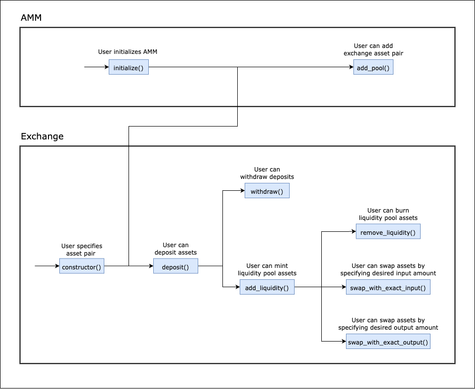

Table of Contents
- [Overview](#overview)
- [Use Cases](#use-cases)
  - [AMM Contract](#amm-contract)
    - [Core Functionality](#core-functionality)
      - [`initialize()`](#initialize)
      - [`add_pool()`](#add_pool)
    - [State Checks](#state-checks)
      - [`pool()`](#pool)
  - [Exchange Contract](#exchange-contract)
    - [Core Functionality](#core-functionality-1)
      - [`constructor()`](#constructor)
      - [`deposit()`](#deposit)
      - [`add_liquidity()`](#add_liquidity)
      - [`remove_liquidity()`](#remove_liquidity)
      - [`withdraw()`](#withdraw)
      - [`swap_exact_input()`](#swap_exact_input)
      - [`swap_exact_output()`](#swap_exact_output)
    - [Previews](#previews)
      - [`preview_add_liquidity()`](#preview_add_liquidity)
      - [`preview_swap_exact_input()`](#preview_swap_exact_input)
      - [`preview_swap_exact_output()`](#preview_swap_exact_output)
    - [State Checks](#state-checks-1)
      - [`balance()`](#balance)
      - [`pool_info()`](#pool_info)
  - [Scripts](#scripts)
    - [`atomic-add-liquidity`](#atomic-add-liquidity)
    - [`swap-exact-input`](#swap-exact-input)
    - [`swap-exact-output`](#swap-exact-output)
- [Sequence Diagram](#sequence-diagram)

# Overview

This document provides an overview of the application.

It outlines the use cases, i.e., desirable functionality, in addition to requirements for the smart contracts and scripts.

# Use Cases

This section contains general information about the functionality of the application and thus does not touch upon any technical aspects.

If you are interested in a functional overview then this is the section for you.

## AMM Contract

### Core Functionality 

#### `initialize()`

1. Specifies the legitimate exchange contract implementation that the AMM will operate with (this is a safety mechanism against adding malicious exchange contract implementations to the AMM)
    1. Requires bytecode root of the desired exchange contract implementation

#### `add_pool()`
1. Adds the liquidity pool for the specified asset pair
    1. If the AMM is initialized
    2. Requires the identifiers of the two assets
    3. Requires the exchange contract identifier that is also the identifier of the liquidity pool asset for the given pair 
        1. If the exchange contract is legitimate, i.e., the bytecode root matches
        2. If the exchange contract defines the pool for the specified asset pair

### State Checks

#### `pool()`

1. Returns the exchange contract identifier for an asset pair
    1. Requires the identifiers of the two assets

## Exchange Contract

### Core Functionality 

#### `constructor()`

1. Allows specifying the asset pair that the liquidity pool in the exchange contract will consist of
    1. If the asset pair for the exchange contract has not already been set 
    2. Requires two different asset identifiers

#### `deposit()`

1. Deposits an asset into the contract
    1. If the asset pair of the pool is set 
    2. Requires any amount of either asset in the pair

#### `add_liquidity()`

1. Allows adding liquidity to the pool by using up at least one asset's deposited amount
    1. If the asset pair of the pool is set
    2. If the deadline has not passed
    3. If the deposit amounts of both assets are sufficient for adding desired liquidity
    4. If the resulting liquidity amount is more than the minimum liquidity for a pool to exist. 
        > **NOTE** This lower limit for liquidity can be modified per asset pair and exists to protect against excessive slippage.
    5. Requires the desired liquidity amount
    6. Requires a deadline (block height limit)

#### `remove_liquidity()`

1. Allows removing liquidity from the pool
    1. If the asset pair of the pool is set
    2. If the deadline has not passed
    3. If the amount of liquidity pool assets are sufficient
    4. Requires the minimum amounts of both assets to receive after burning
    5. Requires a deadline (block height limit)

#### `withdraw()`

1. Allows withdrawing previously deposited assets without using them to add liquidity 
    1. If the asset pair of the pool is set
    2. If the deposited amount of the asset is sufficient
    3. Requires an amount of either asset to withdraw

#### `swap_exact_input()`

1. Allows selling an exact amount of an asset for the other asset 
    1. If the asset pair of the pool is set
    2. If the deadline has not passed
    3. If the asset reserve of asset to buy in the contract is sufficient
    4. If the bought amount is not less than the optional minimum output amount
    5. Requires an exact amount of either asset to sell
    6. Requires an optional minimum desired output amount
        > **NOTE** This is a safety mechanism against excessive slippage. The [`preview_swap_exact_input()`](#preview_swap_exact_input) function can be used to calculate a reasonable minimum output amount.
    7. Requires a deadline (block height limit)

#### `swap_exact_output()`

1. Allows selling an asset for an exact amount of the other asset 
    1. If the asset pair of the pool is set
    2. If the deadline has not passed
    3. If the input amount is sufficient
    4. If the asset reserve of asset to buy in the contract is sufficient
    5. If the bought amount is not less than the exact output amount
    6. Requires an exact amount of either asset to buy
    7. Requires a maximum input amount 
        > **NOTE** This is a safety mechanism against excessive slippage. The [`preview_swap_exact_output()`](#preview_swap_exact_output) function can be used to calculate a reasonable maximum input amount.    
    8. Requires a deadline (block height limit)

### Previews

#### `preview_add_liquidity()`

1. Returns the amount of the other asset to input and the liquidity asset amount to receive after an add liquidity operation
    1. If the asset pair of the pool is set 
    2. Requires the amount of an asset to input to [`add_liquidity`](#add_liquidity) 
        > **NOTE** If any liquidity in the contract already exists, then the amount of the other asset is calculated based on the ratio of the assets. Otherwise, the ratio is assumed to be 1.   

#### `preview_swap_exact_input()`

1. Returns the minimum output amount to receive after a [`swap_exact_input`](#swap_exact_input) and whether the output asset reserves are sufficient for the swap
    1. If the asset pair of the pool is set 
    2. Requires an exact amount of either asset to sell

#### `preview_swap_exact_output()`

1. Returns the maximum input amount for a [`swap_exact_output`](#swap_exact_output) and whether the input asset reserves are sufficient for the swap
    1. If the asset pair of the pool is set
    2. If the output asset reserves are sufficient for the swap
    3. Requires an exact amount of either asset to buy

### State Checks

#### `balance()`

1. Returns the asset balance of the sender in the contract 
    1. If the asset pair of the pool is set
    2. Requires the asset identifier to return the balance for

#### `pool_info()`

1. Returns the pool info, i.e., the identifiers and amounts of assets and the liquidity pool asset amount 
    1. If the asset pair of the pool is set

## Scripts

### `atomic-add-liquidity`

1. Deposits pool assets and adds liquidity
    1. If desired liquidity is more than 0
    2. If [`deposit`](#deposit) and [`add_liquidity`](#add_liquidity) conditions are met

### `swap-exact-input`

1. Swaps assets along a route by specifying exact input for each swap
    1. If the route has at least 2 assets
    2. If the AMM has a pool for each subsequent asset pair in route
    3. If the bought amount of the last asset is more than the optional minimum output amount 
    4. If [`swap_exact_input`](#swap_exact_input) conditions are met

### `swap-exact-output`

1. Swaps assets along a route by specifying exact output for each swap
    1. If the route has at least 2 assets
    3. If the AMM has a pool for each subsequent asset pair in route
    3. If the sold amount of the first asset is less than the specified maximum input amount 
    4. If [`swap_exact_output`](#swap_exact_output) conditions are met

# Sequence Diagram

