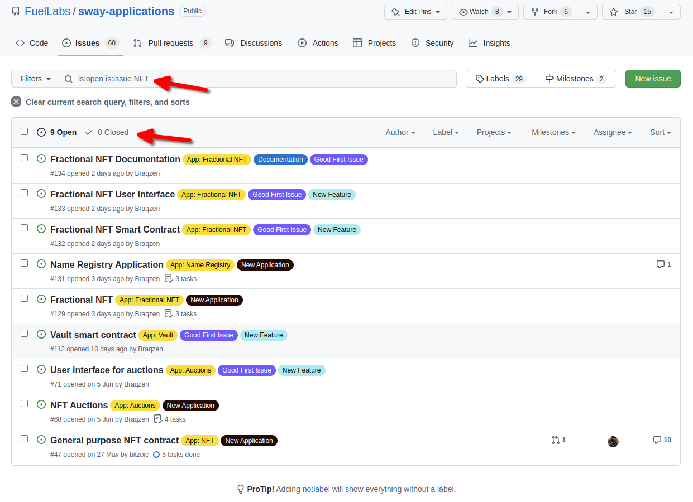

Table of Content
- [Introduction](#introduction)
- [Issues](#issues)
  - [Searching for issues](#searching-for-issues)
  - [Creating issues via templates](#creating-issues-via-templates)
- [Code Quality](#code-quality)
  - [Project Structure](#project-structure)
  - [Code Structure](#code-structure)
  - [Documentation](#documentation)
    - [Code](#code)
    - [Specification](#specification)
      - [Non-technical specification](#non-technical-specification)
      - [Technical specification](#technical-specification)
  - [Testing](#testing)
- [Pull Requests](#pull-requests)
  - [Committing your work](#committing-your-work)
  - [Creating the pull request](#creating-the-pull-request)

----

## Introduction

If you would like to contribute then there are some things to consider if you want your contribution to be fast tracked into the repository. This document will outline what you need to do and the reasoning behind the decisions.

## Issues

Before you jump in and start writing code or submitting pull requests you should first take a look at the opened and closed issues because someone might have already addressed your concern or they may be currently working on it.

### Searching for issues

1. Go to `issues`
2. In the filter add some keywords and search
3. Skim through each opened and closed issue to see if your comment has been addressed



If you cannot find any mention of your concern then feel free to file an issue. On the other hand, if someone has addressed your concern consider whether you should comment on an existing issue or create a new issue to propose a change.

### Creating issues via templates

If you have decided to file a new issue then we encourage the use of the provided templates. They exist in order to help the reader provide the information that we would like to see relating to the type of change that the user wants to make.

Please carefully consider what you want to say and why you want to say it. The issue may be obvious to you; however, we do not know what you are thinking. So structuring your comments and explaining your reasoning will help us understand your concern. The greater the detail the easier it is for us to implement a change.

## Code Quality

### Project Structure

In order to navigate through your project easily there needs to be a structure that compartmentalizes concepts. This means that code is grouped together based on some concept. For example, here is an example structure that we follow for `Sway` files in the `src` directory.

- `data_structures.sw`
  - Contains your custom data structures such as
    - structs
    - enums
    - Any trait implementations of your custom structures
- `errors.sw`
  - Contains enums that are used in `require(..., MyError::SomeError)`
  - The enums are split into individual errors e.g. `DepositError`, `OwnerError` etc.
- `events.sw`
  - Contains structs which are used inside `log()` statements e.g. `log(Deposit { user, amount });`
- `interface.sw`
  - Anything that may be exposed to the user e.g. the `abi` interface for your contract(s)
- `main.sw`
  - The entry point to your contract that contains the implementation of your `abi`
- `utils.sw`
  - Any private functions (helper functions) that your contracts use inside their functions
  - Since a contract cannot call its own function we need to abstract away the code into some functions so that they can be used inside many functions of your contract

> *Note*
> `events.sw` and `interface.sw` might be merged in the future into `interface.sw`

### Code Structure

In order to structure your code there is only 1 rule that you must remember and that is that everything must always be ordered alphabetically - as long as there isn't a dependency error or a better name for a default field of an enum. The reason is that it provides a structure that almost everyone will be familiar with. This means that nobody has to learn how you have decided to structure your code and thus where to look for a variable, function, import etc. This makes it really easy to navigate your entire project and in turn navigate all projects without having to memorize the intricacies of each project.

To be explicit

- All dependencies must be declared in alphabetical order just below the declaration of the program type e.g. below `contract;`
- All imports must be in alphabetical order and any modules within those imports must be in alphabetical order
- All functions, structs, enums, fields inside structs and enums, parameters of a function, parameters in documentation etc. must be in alphabetical order in all files (this does not apply to variables inside a function)

Example

```rust
contract;

dep data_structures;
dep interface;
dep utils;

use data_structures::{Game, Player, Winner};
use interface::{abi::ConnectFour, events::{DrawEvent, MoveEvent, WinnerEvent}};
use std::identity::Identity;
use utils::validate_move;

storage {
   /// The total number of created games
   games_played: u64,

   /// The number of times player 2 has won against player 1
   player_two_wins: u64,

   /// The number of times player 1 has won against player 2
   player_one_wins: u64,
   
   ...
}

impl ConnectFour for Contract {

   fn create_game(player_two: Player, player_one: Player) -> Game {
      // Perform a check on each player address to see if they are blacklisted

      // owl
   }

   fn move(column: u64, game: Game) -> Game {
      // Perform a check to see if the game has ended
      // Perform a check to see if the position is valid
      
      // owl
   }

   // rest of owl

}
```

The only other aspect to remember is to use the formatter before commiting your work.

- `cargo fmt` to format your `Rust` files (SDK tests)
- `forc fmt` to format your `Sway` files

### Documentation

#### Code

For guidance refer to how [Rust](https://doc.rust-lang.org/rustdoc/how-to-write-documentation.html) documents code.

There are two ways to document your code

- Using `///` for official documentation
  - This allows tools to be used and parse out your documentation automatically
- Using `//` for comments
  - These are helper comments within the code to guide the developer who is reading your code
  - They do not get parsed out via automatic doc generation

Each function that is written should be documented (the `///`). The only exception applies to the functions inside the `impl` of your contract (notice that the example above does not have any documentation, that would be on the `abi` that is imported). The documentation for those functions should be on the `abi` because a developer will have access to your `abi` and not necessarily your implementation.

When writing documentation make sure that your arguments are in alphabetical order and any assertions that you have in your function are also documented in the same order. It makes it easier to read the code when you see everything in sequential order rather than searching for where an assertion is placed in the function.

Example

```rust
library interface;

dep data_structures;

use data_structures::{Game, Player};

abi ConnectFour {
   /// Creates a new game
   ///
   /// Creating a game allows players to sequentially take turns placing their marker in an empty
   /// spot until a player reaches four in a row or the board is filled and a draw is declared
   ///
   /// # Arguments
   ///
   /// - `player_two` - The second player to make a move
   /// - `player_one` - The first player to make a move
   ///
   /// # Reverts
   ///
   /// - When a player has been blacklisted for cheating
   fn create_game(player_two: Player, player_one: Player) -> Game;

   /// Places a marker from the next player in the game in the specified column
   ///
   /// # Arguments
   ///
   /// - `column` - The column to place a marker in, range 0 <= column < 8
   /// - `game` - The game to make a move in
   ///
   /// # Reverts
   ///
   /// - When a game has ended in a player winning or a draw
   /// - When a marker is placed into a `column` that is full
   fn move(column: u64, game: Game) -> Game;
}
```

In addition to documenting your functions make sure to document your data structures, events, errors etc. if needed. It is your job to explain to the reader what your code is an what it does so do not make the reader guess. It might be obvious to you but not to the reader.

That being said, there is good documentation and bad documentation.

Example

```rust
// This is bad. It's just repeating what I can already read from the field names
pub struct Item {
   /// Identifier
   id: u64,

   /// Quantity
   quantity: u64,
}

// This is better. It tells me the context of what the fields are
pub struct Item {
   /// Unique identifier used to retrieve the item from a vector of items held in storage
   id: u64,

   /// The number of remaining items left in production
   quantity: u64,
}
```

Documenting your code does not stop at writing documentation. It is also important to name your variables, functions and data structures appropriately. This is a difficult task and it can be argued to be a skill and an art. If your name is too verbose, then it will be difficult to read (because of how much screenspace it takes up) and annoying to use. On the other hand, an abbreviated name requires insider knowledge to be able to infer what the variable is (you could document it extensively however that still means the reader must remember what the documentation says).

There are two general rules to follow:

- Do not abbreviate your names (or use acronyms) unless the abbreviation is used extensively in the area and it is easy to perform an online search and find out more information
  - Remember, if someone starts to abbreviate variables / uses notation that you are unfamiliar with then that forces you to start searching for the information and remembering what something represents
  - Wouldn't it be easier to just read a well named, unabbreviated name instead?
    - `temp` -> `temperature`
      - Do you mean "temporary"? In the context it might be easier to figure out but that requires context for understanding and thus the developer has failed to clearly and accurately convey their intent
    - `x` -> ???
      - What is this temporary, single character variable? Never do this, ever, unless you're dealing with something like an "x-coordinate" where it makes sense to use "x"
- Everything should be a statement instead of a question because statements can be true / false and thus the intent from the developer to the reader is clearer - something either is or is not and the developer is not conveying any uncertainty (this makes it easier to debug)
  - Some examples
    - `can_change` -> `authorized`
      - The "can" can be a question or a statement. Are you asking the reader or are you telling the reader?
    - `is_on` -> `enabled`
      - Similarly, "is" can be a question here rather than a simple declaration

There are many guides online indicating how to create meaningful names. If you are unsure how to name something then how is the reader meant to know what the variable is meant to represent?

#### Specification

A specification can be broken into two levels of detail and the one you choose depends on your target audiance:

- Non-techincal specification
- Technical specification

##### Non-technical specification

This type of specification is meant to be a higher level overview of your project and is meant to be communicated to parties that may not be as tech-savy or even understand the technology at all. For example, when introducing someone to blockchain for the first time one might start to explain how real world transactions work followed by what a ledger is and how that data is stored. Thereafter, conversation of a blockchain might follow etc. The idea is that concepts, real world use cases and explanations are presented to a user in order to gently introduce them to the area. One would absolutely not expect to start the conversation with peer-to-peer communication, node infrastructure, how transactions are selected from a mempool etc.

To be a little more pragmatic, the expectation from a document would be to outline the use cases of your application and explain them.
Here are some uses cases:

- A user can deposit funds
  - What funds can they deposit?
    - `Answer:` A user can deposit tokens: X, Y, Z because they have been vetted by the organization
  - How often can they deposit?
    - `Answer:` A user can deposit as often as they like given that no fault has been detected by the organization which resulted in deposits being paused
  - When can they withdraw their funds?
    - `Answer:` There is a 24 lock up period after which the user can withdraw their deposit in full
- A user can lend out a portion of their funds
  - How much can a user lend out?
    - `Answer:` A user can lend out up to 100% of their currently unlocked deposit
- A user can borrow against a portion of their funds
  - How much can a user borrow?
    - `Answer:` A user can borrow up to at most 50% of their deposit in order to maintain a sufficient collateralization ratio after which liquidation may occur

Each of those use cases would be broken down into steps to see all the possibilities and they would all be evaluated.

> *Note*
> Diagrams are often a very helpful tool to aid in explanations within a specification and thus a diagram for each use case is encouraged

##### Technical specification

The technical specification is an extension of the non-technical specification. This part goes into all of the details that have been deemed too complex to include in the "introduction" (non-technical specification).

> *NOTE*
> A technical specification includes a lot of detail and thus the following does not provide example answers because that depends on your specific use case, your risk profile and trade-offs.

For example, using some of the bullet points above:

- A user can deposit funds
  - What funds can they deposit?
    - How does the system know to only accept tokens: X, Y, Z?
      - Are the token addresses hardcoded or can someone add them at runtime?
    - Who has the authority to tell the system to include that information?
      - If changes can be made at runtime then who is the "owner" who is authorized to make those changes?
    - Do they have authority to make further additions / remove the current tokens?
      - Is there any mechanism that specifies how many tokens they can add, which tokens they can select, how often they can make changes, which addresses they are able to use in order to interact with the system?
    - What happens when a different token is deposited?
      - Do you revert or transfer the funds back - is there some easter egg where you send back a wrapped version of the asset (who knows, it's your system so why not)?
    - Where are the funds stored when a deposit is made?
      - Does the contract that accepts the deposit custody the funds or are they transferred to some vault that is managed by a DAO?

As you can see, a single question spawns more questions which can spawn more technical questions regarding how contracts will be designed (monolithic vs modular, proxies or no proxies, upgradeable?), implemented (each concept can have many implementations - some better than others), deployed etc.

> *NOTE*
> Diagrams are also important in technical documentation because it may be easier to follow a complex workflow visually than having to remember all of the branching sentences / paths

### Testing

TODO

---
## Pull Requests

### Committing your work

Before a pull request can be made there must be work that has been committed and pushed. The content and descriptive message for the commit is important because it makes it easier to track the changes between each commit. Commits should generally be small and specific rather than megalithic changes that touch multiple parts of the codebase that conceptually have nothing to do with each other. The reason is that a small amount of work done is easier to reason about, alter and revert than 1 massive change across the entire codebase.

For example, let's say there are two changes that need to be made:

- A deposit function has a flaw in its assertion
- A separate contract needs additional data structures added in order to log events in a formalized structure (in a struct rather than emitting multiple logs, one per variable)

The correct approach would be to fix the deposit function in 1 commit and then add the formalized logging in a separate commit.

The commit message should be a short sentence describing the changes

- `Good commit message:` Fixed a conditional check in the deposit function which did not fail under condition XYZ
- `Bad commit message:`
  - Fix
  - Fixed function
  - Fixed assertion

It should be clear that the "bad" commit messages do not tell you what the change to the code is because they are too vague. Likewise, the "good" message _could_ be argued to be too long and thus it _could_ deemed as a bad commit message by some - in this case the commit is acceptable because it addresses a single change nevertheless it's a good idea to refine your commit messages so that they are not too verbose / long. If you cannot cut down on the content of the commit message then that can be an indicator that too much work was done in 1 commit. That's not to say that you cannot write a paragraph in a commit however you need to know when that is applicable. For most use cases you shouldn't encounter problems if you keep your work small with a short descriptive sentence like the one above.

If you are unsure of what to write in a commit message then take a look at:

- The README from [joelparkerhenderson](https://github.com/joelparkerhenderson/git-commit-message/#git-commit-message)
- The [Medium article](https://medium.com/swlh/writing-better-commit-messages-9b0b6ff60c67) by Apurva Jain

### Creating the pull request

TODO

Here are some things to consider otherwise your PR may require multiple changes.

- [ ] What is your test coverage like?
- [ ] Does your code require any updates to the CI and if so do all of the cases still pass?
