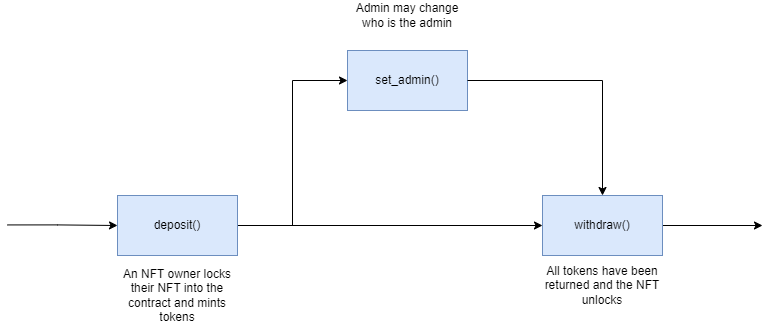
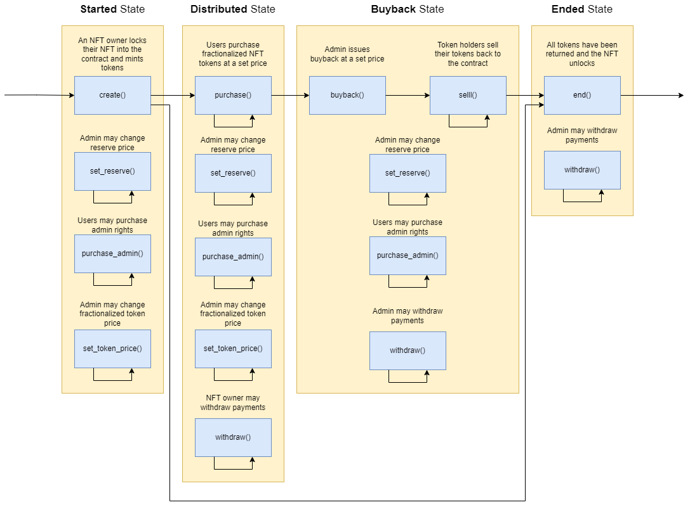

Table of Contents
- [Overview](#overview)
- [Use Cases](#use-cases)
  - [Fractional NFT Contract](#fractional-nft-contract)
    - [Core Functionality](#core-functionality)
      - [`deposit()`](#deposit)
      - [`set_admin()`](#set_admin)
      - [`withdraw()`](#withdraw)
    - [State Checks](#state-checks)
      - [`nft_info()`](#nft_info)
      - [`supply()`](#supply)
  - [Token Distributor Contract](#token-distributor-contract)
    - [Core Functionality](#core-functionality-1)
      - [Token Admin](#token-admin)
        - [`create()`](#create)
        - [`withdraw()`](#withdraw-1)
        - [`buyback()`](#buyback)
        - [`end()`](#end)
        - [`set_reserve()`](#set_reserve)
        - [`set_token_price()`](#set_token_price)
      - [Token Purchaser](#token-purchaser)
        - [`purchase()`](#purchase)
        - [`sell()`](#sell)
        - [`purchase_admin()`](#purchase_admin)
    - [State Checks](#state-checks-1)
      - [`token_distribution()`](#token_distribution)
- [Sequence Diagrams](#sequence-diagrams)
  - [Fractional NFT](#fractional-nft)
  - [Token Distributor](#token-distributor)

# Overview

This document provides an overview of the application.

It outlines the use cases, i.e. desirable functionality, in addition to requirements for the smart contract and the user interface.

# Use Cases

This section contains general information about the functionality of the application and thus does not touch upon any technical aspects.

If you are interested in a functional overview then this is the section for you.

## Fractional NFT Contract

### Core Functionality

#### `deposit()`

1. Allows for a user to lock their NFT and mint fractionalized tokens if
    1. The contract is approved to transfer the NFT

#### `set_admin()`

1. Allows for the contract admin to change the user which may withdraw the underlying NFT

#### `withdraw()`

1. Allows for the contract admin to unlock and regain ownership of the NFT if
    1. All fractionalized tokens are sent to and owned by the Fractional-NFT contract

### State Checks

#### `nft_info()`

1. Returns information on the NFT held by the Fractional-NFT contract

#### `supply()`

1.  Returns the total circulating supply of fractionalized tokens

## Token Distributor Contract

### Core Functionality

#### Token Admin

##### `create()`

1. Allows for a user to lock their NFT, mint fractionalized tokens, and start a distribution if
    1. The contract is approved to transfer the NFT

##### `withdraw()`

1. Allows the token admin to withdraw the payments made by token purchasers

##### `buyback()`

1. Allows the token admin to start a buyback of tokens at a set price if
    1. The payment for all tokens that have been sold is provided
    2. Some tokens have already been sold

##### `end()`

1. Allows the token admin to unlock and regain ownership of the NFT if
    1. All sold fractionalized tokens have been sold back to the contract

##### `set_reserve()`

1. Allows the token admin to change the price to buy admin rights of the underlying NFT

##### `set_token_price()`

1. Allows the token admin to change the price for a single fractionalized NFT token if
    1. The distribution has not ended

#### Token Purchaser

##### `purchase()`

1. Allows for a user to purchase fractionalized tokens at a set price if
    1. The correct payment type and amount is provided
    2. The distribution has not ended

##### `sell()`

1. Allows for a user to sell their fractionalized tokens back to the contract if
    1. A buyback has been initiated

##### `purchase_admin()`

1. Allows for a user to purchase token admin rights for the token distribution if:
    1. A reserve price exists
    2. The correct payment type and amount is provided
    3. The distribution has not ended

### State Checks

#### `token_distribution()`

1.  Returns infomation on a fractionalized token distribution

# Sequence Diagrams

## Fractional NFT

## Token Distributor

