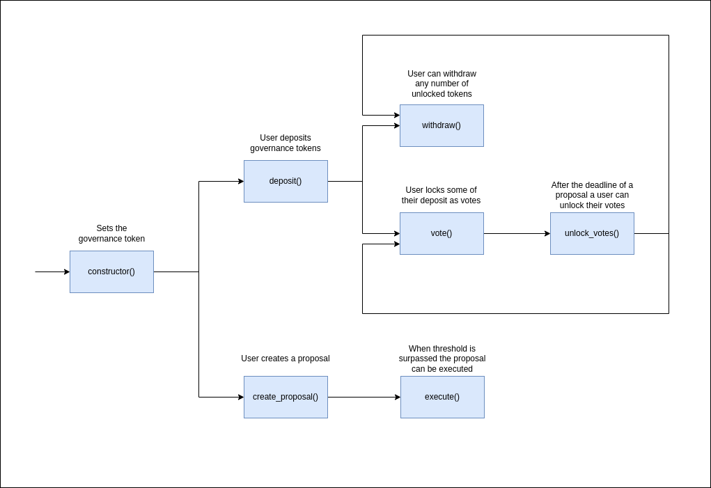

Table of Content
- [Overview](#overview)
- [Use Cases](#use-cases)
  - [Core Functionality](#core-functionality)
    - [`constructor()`](#constructor)
    - [`create_proposal()`](#create_proposal)
    - [`deposit()`](#deposit)
    - [`withdraw()`](#withdraw)
    - [`vote()`](#vote)
    - [`execute()`](#execute)
    - [`unlock_votes()`](#unlock_votes)
  - [State Check](#state-check)
    - [`balance()`](#balance)
    - [`user_balance()`](#user_balance)
    - [`user_votes()`](#user_votes)
    - [`proposal()`](#proposal)
    - [`governance_asset_id()`](#governance_asset_id)
    - [`proposal_count()`](#proposal_count)
  - [Sequence diagram](#sequence-diagram)

# Overview

This document provides an overview of the application.

It outlines the use cases, i.e. desirable functionality, in addition to requirements for the smart contract and the user interface.

# Use Cases

This section contains general information about the functionality of the application and thus does not touch upon any technical aspects.

If you are interested in a functional overview then this is the section for you.

## Core Functionality

### `constructor()`

1. Initializes the contract by setting the governance asset used for voting

### `create_proposal()`

1. Creates a new proposal to be voted on
   1. Contains a threshold representing the number of votes required to allow the proposal to pass
   2. Contains a duration for how long the proposal can be voted on

### `deposit()`

1. Allows a user to deposit any number of governance assets
   1. Each coin deposited equates to one vote the user can cast

### `withdraw()`

1. Allows a user to withdraw any number of governance assets that they have deposited
   1. The user can only withdraw coins that have not been bonded as votes in proposals

### `vote()`

1. Allows a user to vote on a proposal using their unlocked deposit
   1. They can vote in favor of the proposal
   2. They can vote against the proposal
   3. They can vote in favor and against the same proposal
2. Casting a vote reduces the available deposit by the equivalent amount

### `execute()`

1. Allows a proposal to be executed, only once, if
   1. The deadline has been surpassed
   2. The threshold for the proposal passing has been surpassed

### `unlock_votes()`

1. Once the deadline of a proposal has been surpassed a user can unlock those votes
   1. To vote on another proposal
   2. To withdraw

## State Check

### `balance()`

1. Returns the total balance of the governance coins deposited in the contract

### `user_balance()`

1. Returns the number of unlocked governance coins for a user
   1. If a user has voted on a proposal then those coins will not be reflected in this balance

### `user_votes()`

1. Returns the number of votes for a proposal by a user
   1. This consists of the votes in favor / against the proposal

### `proposal()`

1. Returns information about a proposal
   1. The percentage required to make the proposal pass
   2. The author of the proposal
   3. The deadline after which votes can no longer be cast
   4. Whether the proposal has been executed
   5. The raw number of "yes" and "no" votes
   6. Arbitrary data required for the proposal to execute

### `governance_asset_id()`

1. Returns the ID of the governance asset

### `proposal_count()`

1. Returns the total number of proposals created

## Sequence diagram

