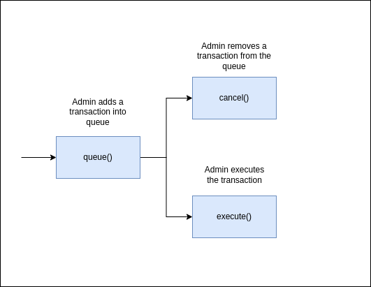

Table of Contents
- [Overview](#overview)
- [Use Cases](#use-cases)
  - [Core Functionality](#core-functionality)
    - [`cancel()`](#cancel)
    - [`execute()`](#execute)
    - [`queue()`](#queue)
  - [Miscellaneous Information](#miscellaneous-information)
    - [`balance()`](#balance)
    - [`delays()`](#delays)
    - [`queued()`](#queued)
    - [`transaction_hash()`](#transaction_hash)
  - [Sequence diagram](#sequence-diagram)

# Overview

This document provides an overview of the application.

It outlines the use cases, i.e. desirable functionality, in addition to requirements for the smart contract and the user interface.

# Use Cases

This section contains general information about the functionality of the application and thus does not touch upon any technical aspects.

If you are interested in a functional overview then this is the section for you.

## Core Functionality

### `cancel()`

### `execute()`

### `queue()`

## Miscellaneous Information

### `balance()`

### `delays()`

### `queued()`

### `transaction_hash()`

## Sequence diagram

