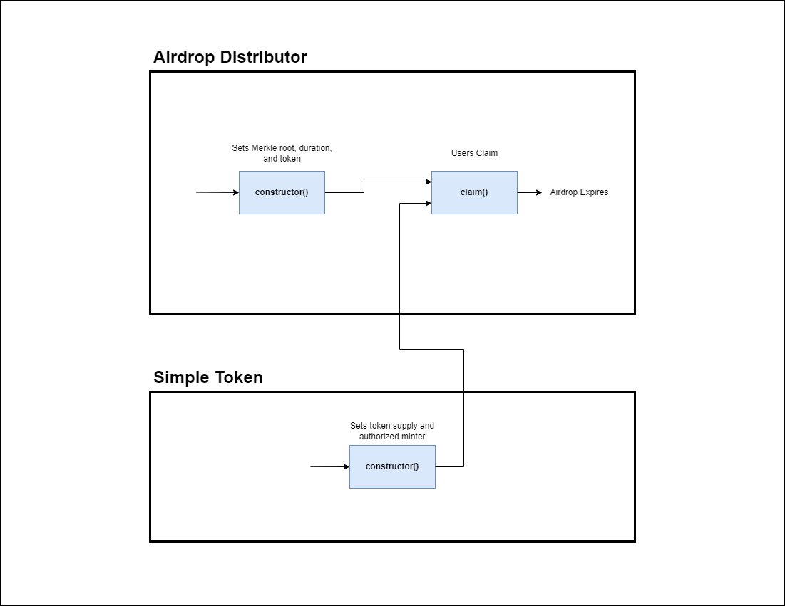

Table of Contents
- [Overview](#overview)
- [Use Cases](#use-cases)
  - [Actions that users are able to perform](#actions-that-users-are-able-to-perform)
    - [Airdrop Core Functionality](#airdrop-core-functionality)
        -[`constructor()`](#constructor)
        -[`claim()`](#claim)
    - [Airdrop State Checks](#airdrop-state-checks)
        -[`claim_data()`](#claim_data)
        -[`end_block()`](#end_block)
        -[`merkle_root()`](#merkle_root)
    - [Simple Token Core Functionality](#simple-token-core-functionality)
        -[`constructor()`](#constructor-1)
- [Sequence Diagram](#sequence-diagram)

# Overview

This document provides an overview of the application.

It outlines the use cases, i.e. desirable functionality, in addition to requirements for the smart contract and the user interface.

This application inherits specification from the [Binary Merkle Proof Verification Library specification](https://github.com/FuelLabs/sway-libs/blob/master/sway_libs/src/merkle_proof/SPECIFICATION.md).

# Use Cases

This section contains general information about the functionality of the application and thus does not touch upon any technical aspects.

If you are interested in a functional overview then this is the section for you.

## Actions that users are able to perform

This sub-section details what a user is able to do e.g. click a button and "x, y, z" happens.

### Airdrop Core Functionality

#### `constructor()`

1. Allows the airdrop to begin and requires
    1. A duration for the airdrop 
    2. A token to airdrop other users
    3. A pre-computed Merkle root

#### `claim()`

1. Allows a user to claim the tokens they have been allotted if,
    1. They have a valid Merkle Proof
    2. The deadline has not passed

### Airdrop State Checks

#### `claim_data()`

1. Returns information of the user's interaction with the airdrop contract
    1. Contains whether the user has claimed 
    2. Contains the number of tokens the user claimed

#### `end_block()`

1. Returns the block at which the airdrop expires

#### `merkle_root()`

1. Returns the stored merkle root used for claim validation

### Simple Token Core Functionality

#### `constructor()`

1. Allows minting of the token to begin
    1. Requires a token supply be given
    2. Requires a user that will be authorized to mint

## Sequence Diagram

