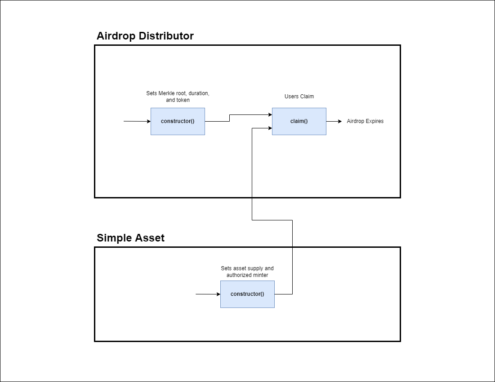

Table of Contents
- [Overview](#overview)
- [Use Cases](#use-cases)
  - [Airdrop](#airdrop)
    - [Core Functionality](#core-functionality)
      - [`constructor()`](#constructor)
      - [`claim()`](#claim)
    - [State Checks](#state-checks)
      - [`claim_data()`](#claim_data)
      - [`end_block()`](#end_block)
      - [`merkle_root()`](#merkle_root)
  - [Simple Asset](#simple-asset)
    - [Core Functionality](#core-functionality-1)
      - [`constructor()`](#constructor-1)
      - [`mint_to()`](#mint_to)
  - [Sequence Diagram](#sequence-diagram)

# Overview

This document provides an overview of the application.

It outlines the use cases, i.e. desirable functionality, in addition to requirements for the smart contract and the user interface.

This application inherits the specification from the [Binary Merkle Proof Verification Library specification](https://github.com/FuelLabs/sway-libs/blob/master/sway_libs/src/merkle_proof/SPECIFICATION.md).

# Use Cases

This section contains general information about the functionality of the application and thus does not touch upon any technical aspects.

If you are interested in a functional overview then this is the section for you.

## Airdrop

### Core Functionality

#### `constructor()`

1. Allows the airdrop to begin and requires
    1. A duration for when a user can claim the airdrop
    2. An asset that a user can claim
    3. A pre-computed Merkle root

#### `claim()`

1. Allows a user to claim the asset they have been allotted if
    1. They have provided a valid Merkle Proof
    2. The deadline has not passed

### State Checks

#### `claim_data()`

1. Returns information of the user's interaction with the airdrop contract
    1. If the user has claimed the airdrop
    2. Contains the amount of asset that a user has claimed

#### `end_block()`

1. Returns the block at which the airdrop expires

#### `merkle_root()`

1. Returns the stored merkle root used for claim validation

## Simple Asset 

### Core Functionality

#### `constructor()`

1. Allows the owner to begin minting the asset and requires
    1. An asset supply be given
    2. A user that will be authorized to mint

#### `mint_to()`

TODO

## Sequence Diagram

