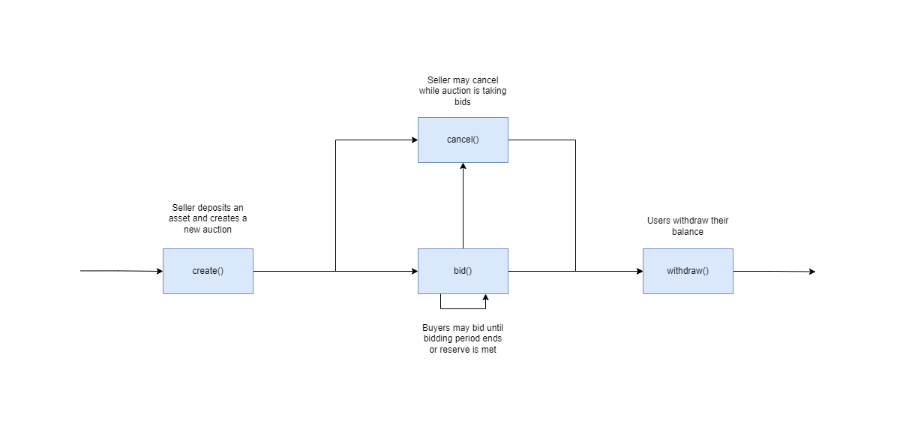

Table of Contents
- [Overview](#overview)
- [Use Cases](#use-cases)
    - [Actions that users are able to perform](#actions-that-users-are-able-to-perform)
        - [English Auction Core Functionality](#english-auction-core-functionality)
            - [`bid()`](#bid)
            - [`cancel()`](#cancel)
            - [`create()`](#create)
            - [`withdraw()`](#withdraw)
        - [English Auction State Checks](#english-auction-state-checks)
            - [`auction_info()`](#auction_info)
            - [`deposit()`](#deposit)
            - [`total_auctions()`](#total_auctions)
- [Sequence Diagram](#sequence-diagram)

# Overview

This document provides an overview of the application.

It outlines the use cases, i.e. desirable functionality, in addition to requirements for the smart contract and the user interface.

# Use Cases

This section contains general information about the functionality of the application and thus does not touch upon any technical aspects.

If you are interested in a functional overview then this is the section for you.

## Actions that users are able to perform

This sub-section details what a user is able to do e.g. click a button and "x, y, z" happens.

### English Auction Core Functionality

#### `bid()`

1. Allows a user to bid upon an auction if
    1. The auction is open for bids (not passed the deadline, cancelled or reserve has not been met)
    2. The users bids with an accepted asset
    3. The bid meets the initial price for the auction or is greater than the last bid
    4. The reserve has not been exceeded

#### `cancel()`

1. Allows a user to cancel an auction they have created if
    1. The auction is open for bids (not passed the deadline or reserve has not been met)

#### `create()`

1. Allows a user to create a new auction if
    1. They have provided an asset to sell
    2. They have provided an asset type to accept as bids
    3. They have provided an initial price
    4. They have provided a duration for the auction
    5. They have specified whether they would like to set a reserve price

#### `withdraw()`

1. Allows a user to withdraw their owed assests for an auction if:
    1. The auction is closed (passed the deadline, cancelled or reserve has been met)
    2. They are the seller or
    3. They have placed a bid and won the auction
    4. They have an outstanding balance

### English Auction State Checks

#### `auction_info()`

1. Returns information on a specific auction

#### `deposit()`

1. Returns the total deposits a user has made for a specific auction

#### `total_auctions()`

1. Returns the total number of auctions that have ever been created with the contract

## Sequence Diagram

