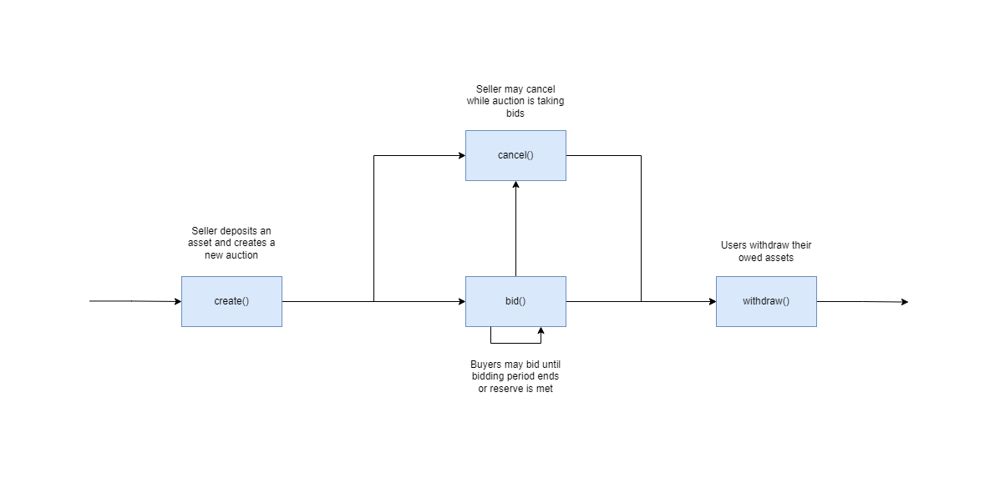

Table of Contents
- [Overview](#overview)
- [Use Cases](#use-cases)
  - [Core Functionality](#core-functionality)
    - [`bid()`](#bid)
    - [`cancel()`](#cancel)
    - [`create()`](#create)
    - [`withdraw()`](#withdraw)
  - [State Checks](#state-checks)
    - [`auction_info()`](#auction_info)
    - [`deposit_balance()`](#deposit_balance)
    - [`total_auctions()`](#total_auctions)
  - [Sequence Diagram](#sequence-diagram)

# Overview

This document provides an overview of the application.

It outlines the use cases, i.e. desirable functionality, in addition to requirements for the smart contract and the user interface.

# Use Cases

This section contains general information about the functionality of the application and thus does not touch upon any technical aspects.

If you are interested in a functional overview then this is the section for you.

## Core Functionality

### `bid()`

1. Allows a user to bid upon an auction if
    1. The auction has not passed the deadline, not been cancelled, and reserve has not been met
    2. The users bids with an accepted asset
    3. The bid meets the initial price for the asset or is greater than the last bid
    4. The user's total bid is either below or meets the reserve

### `cancel()`

1. Allows a user to cancel an auction they have created if
    1. The auction has not passed the deadline and reserve has not been met

### `create()`

1. Allows a user to create a new auction if
    1. They have provided an asset to sell
    2. The asset type that is acceptable to submit as a bid has been specified
    3. An initial price for the asset has been set
    4. The duration for the auction has been set
    5. They have specified whether they would like to set a reserve price

### `withdraw()`

1. Allows a user to withdraw their owed assets for an auction if:
    1. The auction has passed the deadline, been cancelled, or the reserve has been met
    2. They are the seller or have placed a bid
    3. They have an outstanding balance

## State Checks

### `auction_info()`

1. Returns information on a specific auction

### `deposit_balance()`

1. Returns the total deposit amount a user has made for a specific auction

### `total_auctions()`

1. Returns the total number of auctions that have been created by the contract

## Sequence Diagram

