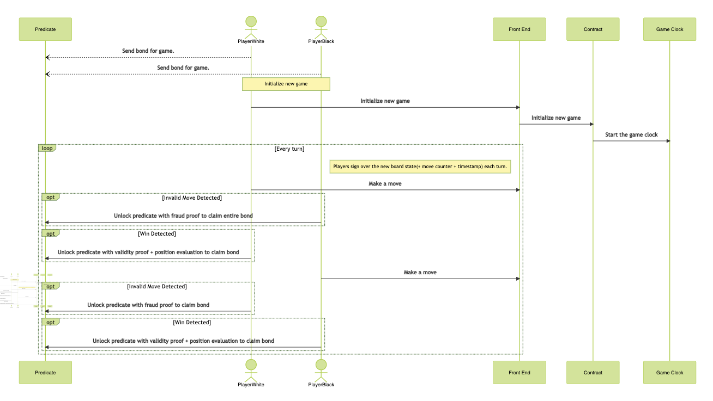

Table of Contents
- [Overview](#overview)
- [Use Cases](#use-cases)
    - [Current Limitations](#current-limitations)
    - [Modes of Play](#modes-of-play)
    - [Actions that users are able to perform](#actions-that-users-are-able-to-perform)
        - [Chess Contract](#chess)
    - [Core Functionality](#core-functionality)
- [Sequence Diagram](#sequence-diagram)

# Overview

This document provides an overview of the application.

It outlines the use cases, i.e., desirable functionality, in addition to requirements for the smart contracts.

# Use Cases

This section contains general information about the functionality of the application and thus does not touch upon any technical aspects.

If you are interested in a functional overview then this is the section for you.

## Current Limitations

This implementation of chess is currently limited to matches between two players.
There is no engine for auto-generation & assesment of moves, so you can't play against the contract (yet).

## Multiple Modes of Play

The game can be played more than one way depending on how you want to approach it.
The most straightforward (and likely most expensive) method is to submit one transaction per half-move (hereafter 1TXM).

Alternately, the game can be played in "Optimistic Mode" via a sort of state channel.
In this mode, a game must be initialized & resolved via transactions to the contract, but the majority of the game can
be played offchain by passing signed `Moves` back and forth over some off-chain communication channel. The players are expected
to hold each other accountable, and an invalid move (let's call it move # 69 by Player 1) can be proven invalid by Player 2, allowing
Player 2 to claim the prize.

In this case, the contract will optimistically assume that all the moves up to & including # 68 were valid, legal chess moves.
The fact that all of these moves have been signed over by the player who made them confirms this, and is the only way the game can
progress to the next move. So, we can safely know that move # 68 (and each move before it) is a valid move, and therefore the resulting state is valid.

In order to prove the invalidity of move # 69, we pass the state before the move, plus the move metadata itself to the contract. The contract will verify
that this is indeed an invalid move by Player 1, awarding the match to Player 2

In both modes, the players must deposit a bond into a contract(TODO: or a Predicate?), and the verified winner can claim the prize.

## Actions that users are able to perform

This sub-section details what a user is able to do, e.g., click a button and "x, y, z" happens.

### Chess Contract
WIP
#### Core Functionality
WIP
# Sequence Diagram: WIP

