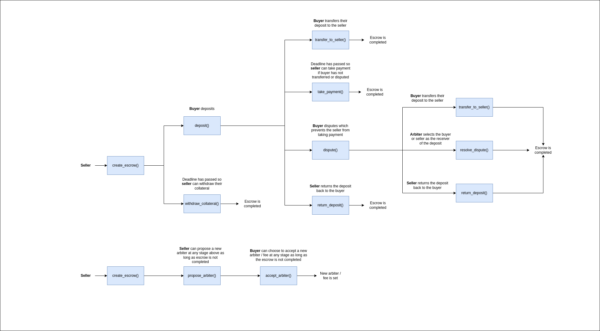

Table of Content
- [Overview](#overview)
- [Use Cases](#use-cases)
  - [Arbiter](#arbiter)
    - [`resolve_dispute()`](#resolve_dispute)
  - [Buyer](#buyer)
    - [`accept_arbiter()`](#accept_arbiter)
    - [`deposit()`](#deposit)
    - [`dispute()`](#dispute)
    - [`transfer_to_seller()`](#transfer_to_seller)
  - [Seller](#seller)
    - [`create_escrow()`](#create_escrow)
    - [`propose_arbiter()`](#propose_arbiter)
    - [`return_deposit()`](#return_deposit)
    - [`take_payment()`](#take_payment)
    - [`withdraw_collateral()`](#withdraw_collateral)
  - [State Checks](#state-checks)
    - [`arbiter_proposal()`](#arbiter_proposal)
    - [`assets()`](#assets)
    - [`escrows()`](#escrows)
    - [`escrow_count()`](#escrow_count)
  - [Sequence diagram](#sequence-diagram)

# Overview

This document provides an overview of the application.

It outlines the use cases, i.e. desirable functionality, in addition to requirements for the smart contract and the user interface.

# Use Cases

This section contains general information about the functionality of the application and thus does not touch upon any technical aspects.

If you are interested in a functional overview then this is the section for you.

## Arbiter

### `resolve_dispute()`

1. When an escrow is in dispute the arbiter of the escrow can perform a resolution in either direction of the buyer or seller
2. A resolution consists of
   1. Selecting either the buyer or seller to whom the deposited asset from the buyer will be sent to
   2. Selecting an amount to take as payment from the collateral provided by the seller

## Buyer

### `accept_arbiter()`

1. The buyer is able to accept a proposition by the seller to change the arbiter or change the fee for the arbiter

> **NOTE** They are not required to do so however there may be instances where changing the arbiter / fee is favourable

### `deposit()`

1. The buyer must deposit into the escrow one asset from the list of assets provided by the seller
2. The escrow accepts a 1 time deposit therefore the buyer cannot go back and deposit a different asset

> **NOTE** Once a buyer deposits they are unable to get the asset out by themselves. Either the arbiter must resolve in their favour or the seller must return the deposit. This is a safety mechanism.

### `dispute()`

1. The buyer is able to `dispute()` the escrow which prevents the seller from taking their deposit after the deadline
2. A dispute leaves the following 3 ways of moving the deposit from the buyer out of the contract
   1. The buyer transfers to seller (`transfer_to_seller()`)
   2. The seller returns the deposit to the buyer (`return_deposit()`)
   3. The arbiter may come in and resolve the dispute in favour of the buyer or seller (`resolve_dispute()`)

### `transfer_to_seller()`

1. When the buyer is satisfied with the exchange then they are able to transfer the funds to the seller

> **NOTE** They are not required to do so however being a good samaritan is nice. The seller can take the payment later themselves if the escrow is not in dispute

## Seller

### `create_escrow()`

1. Any user that creates an escrow is automatically considered the seller
2. Creating an escrow requires depositing collateral as payment for a possible arbitration
3. When creating an escrow the seller provides a list of assets that they are willing to accept as payment from the buyer

### `propose_arbiter()`

1. The seller may propose a change to the arbiter or arbiter fee
   1. This requires a new deposit as collateral
2. This can be done an unlimited number of times
   1. If this is done more than once in a row before the buyer accepts then the previous collateral will automatically be returned to the seller
3. If the buyer accepts then the previous collateral will be returned to the seller
4. If the buyer does not accept then upon completion of the escrow the unused collateral will be returned to the seller

### `return_deposit()`

1. The seller is able to finish the exchange by returning the locked deposit from the buyer back to the buyer

### `take_payment()`

1. The seller is able to finish the exchange by taking the deposit from the buyer if the buyer has not disputed and the deadline has been passed
   1. The buyer may not bother to complete the exchange since it requires an additional transaction which has a cost therefore the seller can assume that no dispute after the deadline means the buyer is satisfied

### `withdraw_collateral()`

1. If the seller creates an escrow and the buyer never deposits then the seller has to be able to withdraw the arbiter collateral. Once the deadline is past and no deposit has been made then the seller can withdraw

## State Checks

### `arbiter_proposal()`

1. Returns the proposed arbiter for resolution
   1. Address identifying the arbiter
   2. The asset that the arbiter will be paid in upon resolution
   3. The quantity of asset to be taken as payment

### `assets()`

1. Returns the information about the asset used in an escrow
   1. Amount of asset the user must deposit
   2. The id used to identify the asset for deposit

### `escrows()`

1. Returns information about an escrow
   1. Address identifying the arbiter
   2. Total number of assets the escrow accepts
   3. The authorized user who is able to make a payment into the escrow
   4. End height after which the buyer can no longer deposit and the seller can take payment
   5. Marker set by the buyer to lock the escrow and prevent the seller from taking payment
   6. Index of the first asset the escrow accepts
   7. The authorized user who is the recipient of payments made by the buyer
   8. The state of the escrow i.e. Pending, Completed

### `escrow_count()`

1. Returns the total number of escrows created in the contract

## Sequence diagram

