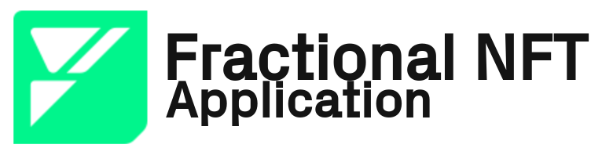

<p align="center">
    <picture>
        <source media="(prefers-color-scheme: dark)" srcset=".docs/f-nft-logo_white.png">
        
    </picture>
</p>

<p align="center">
    <a href="https://crates.io/crates/forc/0.49.1" alt="forc">
        
    </a>
    <a href="https://crates.io/crates/fuel-core/0.22.0" alt="fuel-core">
        
    </a>
</p>

## Overview

A fractional non-fungible token (F-NFT) is a unique asset that represents a share or portion of ownership over a non-fungible token (NFT). On the Fuel Network, all NFTs and F-NFTs are [Native Assets](https://docs.fuel.network/docs/sway/blockchain-development/native_assets). F-NFTs are often created to sell partial ownership of an NFT on a secondary market, especially in royalty NFTs to split a profit.

In this barebones F-NFT example project, where locking a NFT into the vault will issue 100,000,000 shares. When all shares are sent to the vault in the same transaction, the NFT is unlocked and can be withdrawn.

## Standards Implementations

The project implements and follows the [SRC-6; Vault](https://github.com/FuelLabs/sway-standards/blob/master/SRCs/src-6.md) and [SRC-20; Native Asset](https://github.com/FuelLabs/sway-standards/blob/master/SRCs/src-20.md) standards. 

### SRC-6

The [SRC-6](https://github.com/FuelLabs/sway-standards/blob/master/SRCs/src-6.md) standard defines the ABI for locking an NFT in a vault and minting shares. This has been properly implemented.

```sway
abi SRC6 {
    #[payable]
    #[storage(read, write)]
    fn deposit(receiver: Identity, vault_sub_id: SubId) -> u64;
    #[payable]
    #[storage(read, write)]
    fn withdraw(receiver: Identity, underlying_asset: AssetId, vault_sub_id: SubId) -> u64;
    #[storage(read)]
    fn managed_assets(underlying_asset: AssetId, vault_sub_id: SubId) -> u64;
    #[storage(read)]
    fn max_depositable(receiver: Identity, underlying_asset: AssetId, vault_sub_id: SubId) -> Option<u64>;
    #[storage(read)]
    fn max_withdrawable(underlying_asset: AssetId, vault_sub_id: SubId) -> Option<u64>;
}
```

### SRC-20

The [SRC-20](https://github.com/FuelLabs/sway-standards/blob/master/SRCs/src-20.md) standard has been implemented for the resulting minted shares when a NFT is locked in the vault. Information on the share assets can be queried with the [SRC-20](https://github.com/FuelLabs/sway-standards/blob/master/SRCs/src-20.md) standard.

```sway
abi SRC20 {
    #[storage(read)]
    fn total_assets() -> u64;
    #[storage(read)]
    fn total_supply(asset: AssetId) -> Option<u64>;
    #[storage(read)]
    fn name(asset: AssetId) -> Option<String>;
    #[storage(read)]
    fn symbol(asset: AssetId) -> Option<String>;
    #[storage(read)]
    fn decimals(asset: AssetId) -> Option<u8>;
}
```

## Project structure

The project consists of a smart contract.

<!--Only show most important files e.g. script to run, build etc.-->

```sh
fractional-NFT
├── f-NFT-contract
│   └──src/main.sw
├── README.md
└── SPECIFICATION.md
```

## Running the project

### User interface

TODO: The user interface does not currently exist.

### Project

In order to run the subsequent commands change into the following directory `/path/to/fractional-NFT/<here>`.

#### Program compilation

```bash
forc build
```

#### Running the tests

Before running the tests the programs must be compiled with the command above.

```bash
cargo test 
```
