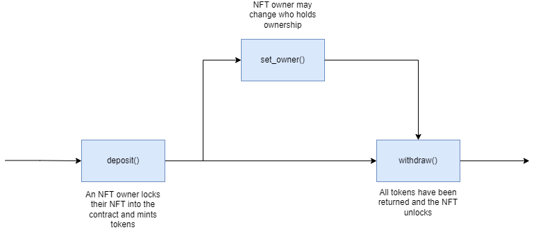
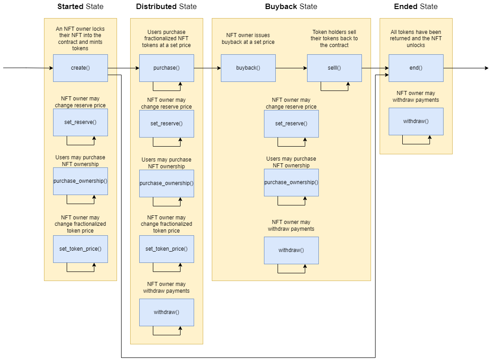

# Overview

This document provides an overview of the application.

It outlines the use cases, i.e. desirable functionality, in addition to requirements for the smart contract and the user interface.

# Use Cases

This section contains general information about the functionality of the application and thus does not touch upon any technical aspects.

If you are interested in a functional overview then this is the section for you.

## Actions that users are able to perform

This sub-section details what a user is able to do e.g. click a button and "x, y, z" happens.

### Fractional-NFT Core Functionality

#### `deposit()`

1. Allows for a user to lock their NFT and mint fractionalized tokens if
    1. The contract is approved to transfer the NFT

#### `set_owner()`

1. Allows for the owner to change the owner of the NFT

#### `withdraw()`

1. Allows for the owner to unlock and regain ownership of the NFT if
    1. All fractionalized tokens are sent to and owned by the Fractional-NFT contract

### Fractional-NFT State Checks

#### `nft_info()`

1. Returns information on the NFT held by the Fractional-NFT contract

#### `supply()`

1.  Returns the total circulating supply of fractionalized tokens

## Fractional NFT Sequence Diagram

### Token Distributor NFT Owner Core Functionality

#### `create()`

1. Allows for a user to lock their NFT, mint fractionalized tokens, and start a distribution if
    1. The contract is approved to transfer the NFT

#### `withdraw()`

1. Allows the owner to withdraw the payments made by token purchasers

#### `buyback()`

1. Allows the owner to start a buyback of tokens at a set price if
    1. The payment for all tokens that have been sold is provided
    2. Some tokens have already been sold

#### `end()`

1. Allows the owner to unlock and regain ownership of the NFT if
    1. All sold fractionalized tokens have been sold back to the contract

#### `set_token_price()`

1. Allows the owner to change the price for a single fractionalized NFT token if
    1. The distribution has not ended

#### `set_reserve()`

1. Allows the owner to change the price to buy ownership of the underlying NFT

### Token Distributor Token Purchaser Core Functionality

#### `purchase()`

1. Allows for a user to purchase fractionalized tokens at a set price if
    1. The correct payment type and amount is provided
    2. The distribution has not ended

#### `sell()`

1. Allows for a user to sell their fractionalized tokens back to the contract if
    1. A buyback has been initiated

#### `purchase_ownership()`

1. Allows for a user to purchase the underlying fractionalized NFT if
    1. The correct payment type and amount is provided
    2. The distribution has not ended

### Token Distributor State Checks

#### `token_distribution()`

1.  Returns infomation on a fractionalized token distribution

## Token Distributor Sequence Diagram

