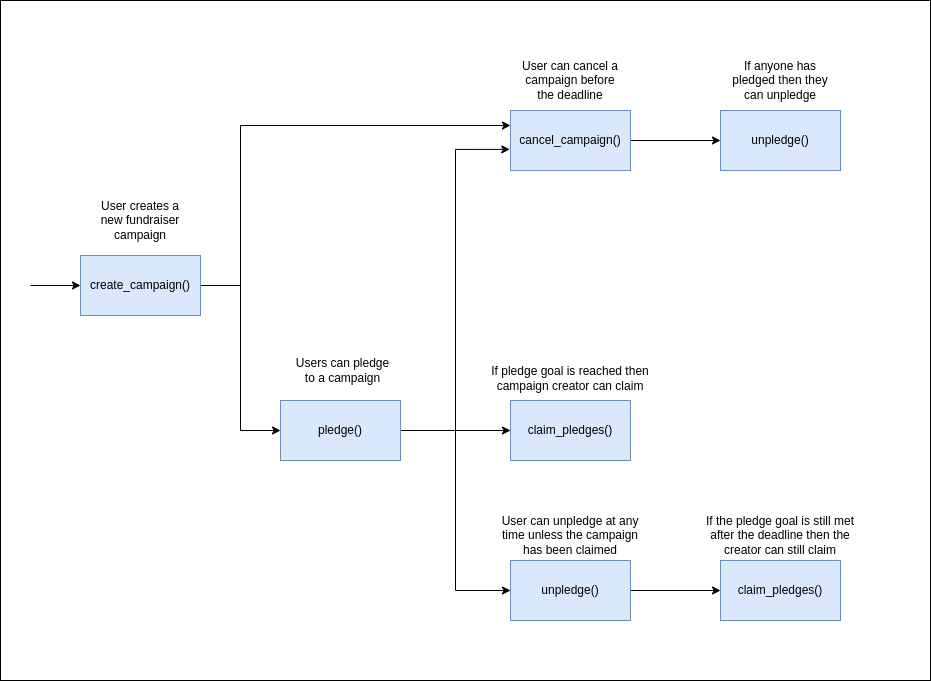

Table of Content
- [Overview](#overview)
- [Use Cases](#use-cases)
  - [Actions that users are able to perform](#actions-that-users-are-able-to-perform)
    - [`create_campaign()`](#create_campaign)
    - [`cancel_campaign()`](#cancel_campaign)
    - [`claim_pledges()`](#claim_pledges)
    - [`pledge()`](#pledge)
    - [`unpledge()`](#unpledge)
  - [Information that is presented to users](#information-that-is-presented-to-users)
    - [`asset_count()`](#asset_count)
    - [`asset_info_by_id()`](#asset_info_by_id)
    - [`asset_info_by_count()`](#asset_info_by_count)
    - [`campaign()`](#campaign)
    - [`campaign_info()`](#campaign_info)
    - [`pledged()`](#pledged)
    - [`pledge_count()`](#pledge_count)
    - [`total_campaigns()`](#total_campaigns)
    - [`user_campaign_count()`](#user_campaign_count)
    - [Author](#author)
    - [User](#user)
    - [Discovery of Campaigns](#discovery-of-campaigns)
    - [Misc](#misc)
  - [Sequence diagram](#sequence-diagram)

# Overview

This document provides an overview of the application.

It outlines the use cases, i.e. desirable functionality, in addition to requirements for the smart contract and the user interface.

# Use Cases

This section contains general information about the functionality of the application and thus does not touch upon any technical aspects.

If you are interested in a functional overview then this is the section for you.

## Actions that users are able to perform

This sub-section details what a user is able to do e.g. click a button and "x, y, z" happens.

### `create_campaign()`

A user should be able to create a campaign which consists of

1. The asset that the campaign accepts
2. The amount of asset required to deem the campaign a success a.k.a the goal
3. A deadline after which the campaign is locked and deemed as concluded
4. The beneficiary to whom the asset will be sent to upon reaching the goal

### `cancel_campaign()`

The author of a campaign should be able to cancel (end) the campaign

1. If the campaign has not reached its deadline
2. If the campaign has not been cancelled before
3. If the campaign has not been claimed

### `claim_pledges()`

The author of a campaign should be able to claim the total amount pledged

1. After the deadline has been passed
2. If the target amount (goal) has been reached
3. If they have not claimed before
4. If they have not cancelled before

### `pledge()`

A user should be able to pledge to any campaign

1. If the campaign is active (not passed the deadline, cancelled or claimed)
2. If they send the correct asset to the campaign

### `unpledge()`

A user should be able to unpledge any amount that they have pledged

1. If the campaign has not been claimed

## Information that is presented to users

This sub-section details the information that a user should have access to / what the application provides to them e.g. a history of their previous actions.

### `asset_count()`

Returns the total number of uniquely pledged assets

1. If two different campaigns receive a pledge from the same asset then the `asset_count()` will be 1
2. If two different campaigns receive a pledge from two different assets then the `asset_count()` will be 2

### `asset_info_by_id()`

Returns information about a specified asset through the use of its contract ID

1. The total amount that has been pledged across all campaigns
2. If the asset has been specified by any campaign

### `asset_info_by_count()`

Returns information about a specified asset through the use of an index

1. The total amount that has been pledged across all campaigns
2. If the asset has been specified by any campaign

### `campaign()`

Returns the identifier used to track a campaign for a specified user

### `campaign_info()`

Returns data representing the state of a campaign

1. The creator of the campaign
2. The asset the campaign accepts for deposit
3. Who the pledges will be sent to upon reaching the target amount
4. Whether the campaign has been cancelled / claimed
5. The deadline after which the campaign expires
6. The target amount (goal) set for the campaign and the current amount pledged

### `pledged()`

Returns information regarding the amount pledged by a user to a specific campaign

### `pledge_count()`

Returns the total number of uniquely pledged assets by a user

1. If a user has pledgd 1 asset (any number of times) then the `pledge_count()` will be 1
2. If a user has pledgd 2 different assets (any number of times) then the `pledge_count()` will be 2

### `total_campaigns()`

Returns the total number of created campaigns

### `user_campaign_count()`

Returns the total number of campaigns that a user has pledged to

1. If a user pledges to 2 different campaigns then the `user_pledge_count()` will be 2
2. If the user performs step 1. and then completely unpledges then `user_pledge_count()` will be 2

### Author

An author should be able to see a history of the campaigns that they have created

1. This should be categorized into currently active and completed campaigns
2. An active campaign is one that has not reached its deadline nor has been cancelled by the author
3. The author should see 
   1. When the campaign ends / time until the deadline
   2. Which campaigns have been cancelled / claimed
   3. The state of the campaign i.e. whether the campaign has succeeded in reaching its goal
      1. Pending state is when the deadline has not been reached
      2. Successful state is when the deadline is reached and the goal has been reached
      3. Failed state is when the deadline is reached and the goal has not been reached
      4. Cancelled state is when the author has cancelled the campaign
   4. The amount pledged by all users and how much is needed to reach the goal
   5. Who the beneficiary is
   6. Which asset the campaign accepts

### User

A user should be able to see the campaigns that they have pledged towards

1. This includes the amount that they have pledged
2. The campaigns should be categorized into active and completed campaigns
3. Only the user should be able to see how much they have pledged

### Discovery of Campaigns

Authors of campaigns and users should be able to share / find campaigns

1. Campaigns should be searchable via the address of the author
   1. `Some category / identifier too ?`

> **NOTE** \
> TODO: how is this information presented to users, is there some main page of all campaigns?

### Misc

1. Track each asset across all campaigns to see how popular each asset is
2. Show total number of campaigns created

> **NOTE** \
> TODO: figure out where to put this info and what else to add

## Sequence diagram

