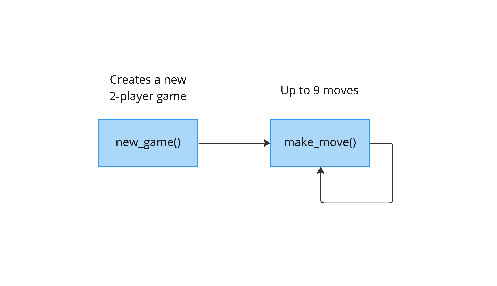

Table of Contents
- [Overview](#overview)
- [Use Cases](#use-cases)
  - [Core Functionality](#core-functionality)
    - [`new_game()`](#new_game)
    - [`make_move()`](#make_move)
  - [Diagrams](#diagrams)
    - [Sequence Diagram](#sequence-diagram)

# Overview

This document provides an overview of the application.

It outlines the use cases, i.e. desirable functionality, in addition to requirements for the smart contract and the user interface.

# Use Cases

This section contains general information about the functionality of the application and thus does not touch upon any technical aspects.

If you are interested in a functional overview then this is the section for you.

## Core Functionality

### `new_game()`

1. Initializes a new game with 2 players and resets the previous state. 
2. Reverts when: 
   1. When a game has not finished.

### `make_move()`

1. Allows a player to place a marker on the game board.
2. Checks if either the game has been won or if it's a draw.
3. Reverts when:
   1. When the game has ended.
   2. If the incorrect player tries to make a move.
   3. If a player makes a move out of bounds.
   4. If a player makes a move in an occupied cell.

## Diagrams

### Sequence Diagram

