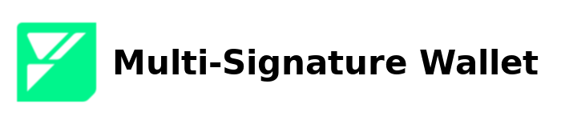

<p align="center">
    <picture>
        <source media="(prefers-color-scheme: dark)" srcset=".docs/multi-signature-logo-dark-theme.png">
        
    </picture>
</p>

<p align="center">
    <a href="https://crates.io/crates/forc/0.49.1" alt="forc">
        
    </a>
    <a href="https://crates.io/crates/fuel-core/0.22.0" alt="fuel-core">
        
    </a>
    <a href="https://crates.io/crates/fuels/0.53.0" alt="forc">
        
    </a>
</p>

## Overview

A multi-signature wallet is a wallet that has multiple owners. In order to execute a transaction, a sufficient number of owners need to sign a transaction. This implementation uses weighted owners which means that certain owners may have more "votes" when it comes to increasing the number of approvals in order to surpass the minimum threshold for execution. This implementation allows owners to be both Fuel and EVM addresses; by additionally supporting signatures over [EIP-191](https://eips.ethereum.org/EIPS/eip-191) formatted messages.

More information can be found in the [specification](./SPECIFICATION.md).

## Project structure

The project consists of a smart contract.

<!--Only show most important files e.g. script to run, build etc.-->

```sh
multisig-wallet
├── multisig-contract
│   ├── src/main.sw
│   └── tests/harness.rs
├── README.md
└── SPECIFICATION.md
```

## Running the project

### User interface

TODO: The user interface does not currently exist.

### Project

In order to run the subsequent commands change into the following directory `/path/to/multisig-wallet/<here>`.

#### Program compilation

```bash
forc build --locked
```

#### Running the tests

Before running the tests the programs must be compiled with the command above.

```bash
cargo test --locked
```
