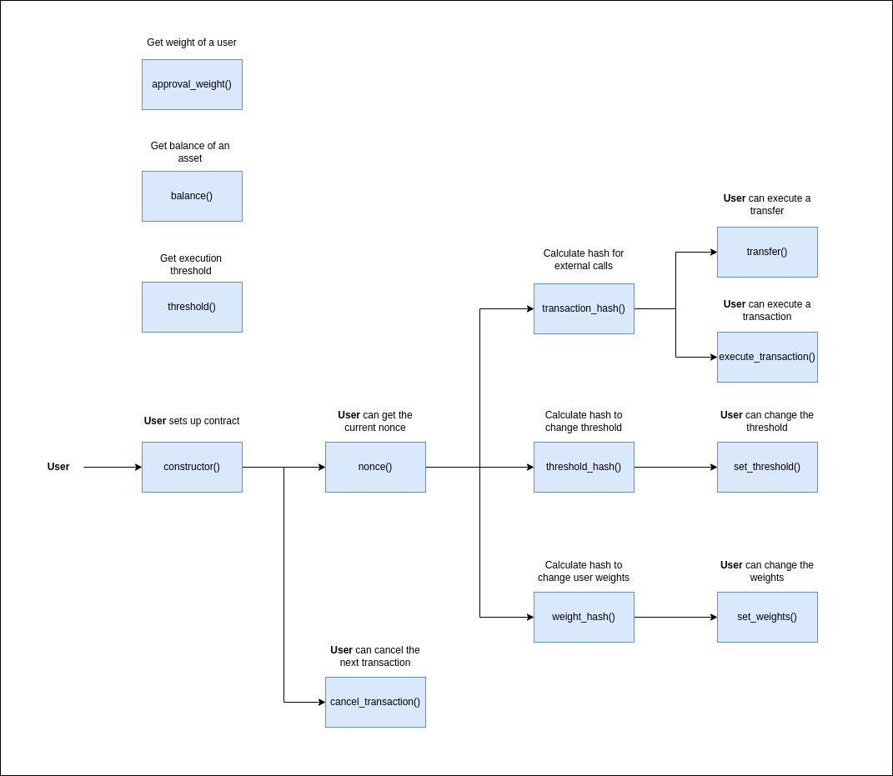

Table of Contents

- [Overview](#overview)
- [Use Cases](#use-cases)
  - [Core Functionality](#core-functionality)
    - [`constructor()`](#constructor)
    - [`execute_transaction()`](#execute_transaction)
    - [`set_threshold()`](#set_threshold)
    - [`set_weight()`](#set_weight)
  - [State Checks](#state-checks)
    - [`approval_weight()`](#approval_weight)
    - [`balance()`](#balance)
    - [`nonce()`](#nonce)
    - [`threshold()`](#threshold)
  - [Utilities](#utilities)
    - [`compute_hash()`](#compute_hash)
  - [Sequence Diagram](#sequence-diagram)

# Overview

This document provides an overview of the application.

It outlines the use cases, i.e., desirable functionality, in addition to requirements for the smart contracts.

# Use Cases

This section contains general information about the functionality of the application and thus does not touch upon any technical aspects.

If you are interested in a functional overview then this is the section for you.

## Core Functionality

### `constructor()`

1. Sets the parameters for approving a transaction and sets the owners of the multisig.
   1. If the constructor hasn't already been called.
   2. Requires the config time constant `THRESHOLD`; the number of approvals required for a transaction to occur.
      1. If the `THRESHOLD` is not 0.
   3. Requires the `users`; the information about the owners of the multisig
      1. If the sum of the owners' approval weightings is a value larger than the `threshold` parameter. This prevents the contract being setup when the owners can never submit enough approvals to allow a transaction.

### `execute_transaction()`

1. Execute either a transfer or a contract call.
2. Reverts when:
   1. The constructor has not been called to initialize the contract.
   2. Attempting to transfer with `transfer_params.value` as [Option::None].
   3. The amount of the asset being sent is greater than the balance in the contract.
   4. The public key cannot be recovered from a signature.
   5. The recovered addresses in `count_approvals `are not in ascending order (0x1 < 0x2 < 0x3...) [b256].
   6. The total approval count is less than the required threshold for execution.
   7. Attempting to call when `target` is not a [Identity::ContractId].

### `set_threshold()`

1. Changes the threshold required for execution of transactions.
2. Reverts when:
   1. The constructor has not been called.
   2. The new threshold is zero.
   3. The new threshold is greater than the total weight of the owners.
   4. Signature recovery failed.
   5. Recovered addresses are not in ascending order.
   6. The number of approvals does not meet the threshold.

### `set_weight()`

1. Sets the weight of a user which may be able to vote on the execution of transactions.
2. Reverts when:
   1. The constructor has not been called.
   2. Signature recovery failed.
   3. The number of approvals does not meet the threshold.
   4. The new total weighting is less than the threshold.

## State Checks

### `approval_weight()`

1. Returns the approval weight of a user.

### `balance()`

1. Returns the contract's balance of the specified asset.
   1. Requires `asset_id`; The contract ID of the asset to check that balance of.

### `nonce()`

1. Returns the current nonce of the contract.

### `threshold()`

1. Returns the threshold for execution.

## Utilities

### `compute_hash()`

1. Takes a struct comprised of transaction data and hashes it.

## Sequence Diagram

