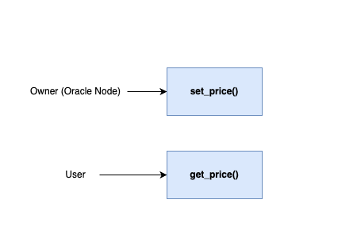

# Overview

This document provides an overview of the application.

It outlines the use cases, i.e. desirable functionality, in addition to requirements for the smart contract and the oracle node.

# Use Cases

This section contains general information about the functionality of the application and thus does not touch upon any technical aspects.

If you are interested in a functional overview then this is for you.

## Actions that users are able to perform

This sub-section details what a user is able to do e.g. click a button and "x, y, z" happens.

### Oracle Node

`set_price()`

1. The oracle's node is the only address allowed to set the price of the asset the oracle is tracking.

### Oracle Consumer

`owner()`
1. Anyone can call this function to get the owner (node) of the oracle contract
> **Note**
> The owner is initialized to the first deterministically generated wallet using the SDK in `Forc.toml`

`price()`

1. Anyone can call this function to get the asset price that the oracle is tracking

## Sequence Diagram

