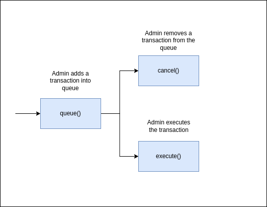
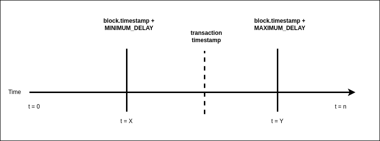

Table of Contents
- [Overview](#overview)
- [Use Cases](#use-cases)
  - [Core Functionality](#core-functionality)
    - [`cancel()`](#cancel)
    - [`execute()`](#execute)
    - [`queue()`](#queue)
  - [Miscellaneous Information](#miscellaneous-information)
    - [`balance()`](#balance)
    - [`delays()`](#delays)
    - [`queued()`](#queued)
    - [`transaction_hash()`](#transaction_hash)
  - [Diagrams](#diagrams)
    - [Sequence Diagram](#sequence-diagram)
    - [Timestamp Validity](#timestamp-validity)

# Overview

This document provides an overview of the application.

It outlines the use cases, i.e. desirable functionality, in addition to requirements for the smart contract and the user interface.

# Use Cases

This section contains general information about the functionality of the application and thus does not touch upon any technical aspects.

If you are interested in a functional overview then this is the section for you.

## Core Functionality

### `cancel()`

The admin should be able to remove a transaction from the queue

1. If the `id` of the transaction is in the queue

### `execute()`

The admin should be able to execute a queued transaction

1. If the `id` of the transaction is in the queue
2. If the transaction is being executed during the valid time range for that transaction
3. If the transaction involves a transfer then the contract must have a sufficient balance

### `queue()`

The admin should be able to add a transaction into a queue for execution

1. If the `id` of the transaction is not currently in the queue
2. If the transaction timestamp is in the valid time range of (`MINIMUM_DELAY`, `MAXIMUM_DELAY`)
   1. A valid timestamp is inclusive of and falls in between the constants
   2. To calculate the `DELAY` bounds add the block timestamp to each constant

## Miscellaneous Information

### `balance()`

Returns the amount of a specified asset in the contract

### `delays()`

Returns the (`MINIMUM_DELAY`, `MAXIMUM_DELAY`) variables used for timestamp validity

### `queued()`

Returns an optional struct containing the valid execution time range for a transaction

### `transaction_hash()`

Returns the hash (`id`) of the transaction arguments

## Diagrams

### Sequence Diagram

### Timestamp Validity

1. When submitting a transaction into a [`queue()`](#queue) the timestamp must fall between the `MINIMUM_DELAY` and `MAXIMUM_DELAY`.
2. To [`execute()`](#execute) the transaction the current time `t` must be greater than or equal to the submitted timestamp; however, it must be no greater than the `MAXIMUM_DELAY` time.

