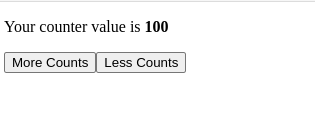

<div id="top"></div>

<div align="center">
  <a href="https://github.com/FuelLabs/sway-applications">
    
  </a>

  <h3 align="center">Sway Counter</h3>

  <p align="center">
    Sway Counter Smart Contract with React and Fuel v2 TypeScript SDK
    <br />
    <a  href="https://fuellabs.github.io/fuels-ts/"><strong>Explore the Fuel TypeScript SDK docs »</strong></a>
  </p>
</div>

## Table of contents

- [About](#about)
- [Getting Started](#getting-started)
  - [Prerequisites](#prerequisites)
  - [Installation](#installation)
  - [How to run the application](#usage)
  - [Application Development Tutorial](#walkthrough)
    - [Creating the smart contract](#1-creating-a-deployable-sway-program)
    - Compiling the contract, generating TypeScript and deploying
      - [Compiling the contract](#2-compiling-your-sway-contract)
      - [Generating TypeScript](#3-generating-typescript-for-sway-contract)
      - [Deploying the contract](#4-deploying-your-sway-contract)
    - [Using the contract in a React project](#5-using-your-sway-contract-in-a-react-project)
- [Contributing](#contributing)
- [License](#license)

## About

In this tutorial, we will build a counter application, using storage on our Sway contract to keep track of a stored number that can be retrieved/ modified as part of our React app. This demonstrates a Sway Program called a Smart Contract, and will show you the basics of using Sway with the [TypeScript SDK](https://fuellabs.github.io/fuels-ts/).

<p align="center">
  
</p>

<p align="right">(<a href="#top">back to top</a>)</p>

## Getting Started

We recommend that you first read through and understand the basics of [Sway](https://fuellabs.github.io/sway/latest/), the DSL for the Fuel Virtual Machine.

### Prerequisites

Your machine will need to have a few things installed in order to run a local fuel node and this React application:

- [The latest LTS version of Node.js](https://nodejs.org/)
- [The latest forc and fuel-core binaries](https://fuellabs.github.io/sway/latest/introduction/installation.html#dependencies)

### Installation

Open this demo application

```sh
cd tutorials/counter
```

Install NPM packages

```sh
npm i
```

### Usage

To quickly run this demo application, follow these steps, or see detailed tutorial below

Run React application in dev mode, make sure to configure a new [`.env`](./.env.example) file.

```sh
npm run dev
```

View in local browser

```sh
open http://localhost:3000
```

### Walkthrough

This application tutorial consists of five main milestones on your journey to writing your first Sway + React app:

1. Creating a deployable Sway program - in this example we will create a [Smart Contract](https://fuellabs.github.io/sway/latest/sway-program-types/smart_contracts.html)
2. Compiling your Sway contract
3. Generating TypeScript for the `counter` program
4. Deploying the `counter` program
5. Using your Sway contract in a React project

#### 1. Creating a deployable Sway program

The counter program is based off the example in the [Sway book](https://fuellabs.github.io/sway/latest/examples/counter.html).

We require 3 functions for our application.

1. Incrementing the counter
2. Decrementing the counter
3. Getting the current value of the counter

Take a look at the following [abi.sw](src/abi.sw) of the program:

```rust
fn increment();
fn decrement();
fn get_counter() -> u64;

#### 2. Compiling your Sway contract

The Sway program source can be compiled into binary and generate an Application Binary Interface (ABI) JSON file that allows typed and strict interoperability between Fuel and development languages like Rust and TypeScript.

While inside this project directory, use this command to take the contents of [main.sw](src/main.sw) and compile it.

```sh
forc build
```

#### 3. Generating TypeScript for Sway contract

Once a Sway program has an Application Binary Interface (ABI) JSON file, TypeScript bindings can be created using the Fuel TypeScript SDK.

For convenience this npm script will run `forc build` from the previous step and then run the generated ABI through [TypeChain](https://github.com/dethcrypto/TypeChain) to create TypeScript types and helpers for the contract.

```sh
npm run build
```

The generated TypeScript will be available in `src/counter-contract-types`.

#### 4. Deploying your Sway contract

Your compiled Sway contract is now ready to be sent into a running Fuel node!

When running `fuel-core` locally, it is useful to have it pre-configured using a chain config, one such example can be found on the [fuels-ts repo](https://github.com/FuelLabs/fuels-ts/blob/master/services/fuel-core/chainConfig.json), which includes a `wallet.privateKey` that you can utilize for a `GENESIS_SECRET` in your local `.env` file.

Create and update `.env` file with relevant values, (see [.env.example](.env.example)):

```
GENESIS_SECRET="<YOUR SECRET>" # for easiest route, should match whats in your chain config
PRIVATE_KEY="<YOUR WALLET PRIVATE KEY>" # generate one - see below
FUEL_PROVIDER_URL="<YOUR FUEL CORE URL>" # will often be http://127.0.0.1:4000/graphql
CONTRACT_ID="<YOUR CONTRACT ID>" # see below
```

For `PRIVATE_KEY`, you can use this helpful script to generate one:

```sh
npm run generate-private-key
```

For `CONTRACT_ID`, once you have your environment variables ready, run this command in your project folder to deploy your Sway contract to your local Fuel provider:

```sh
npm run deploy
```

This will output a new `CONTRACT_ID` to save inside your `.env`. With that, your Sway contract is compiled, deployed, and available via a TypeScript interface.

#### 5. Using your Sway contract in a React project

Your generated Sway TypeScript bindings should be available inside `src/counter-contract-types`, which have a Contract Factory. This is the most intuitive way to utilize a contract in a TypeScript project.

Import the Fuels Wallet class and contract factory:

```javascript
import { Wallet } from "fuels";
import { CounterContractAbi__factory as Factory } from "./counter-contract-types";
```

Create a new Wallet instance using your Wallet Private Key, connecting to your local Fuel Node:

```javascript
const wallet = new Wallet(
  process.env.PRIVATE_KEY,
  process.env.FUEL_PROVIDER_URL
);
```

Finally, connect to your contract via the Factory, to obtain an instance of the Contract that you can then interact with using the created methods:

```javascript
const contractInstance = Factory.connect(process.env.CONTRACT_ID, wallet);
```

The contract instance has access to all of Smart Contracts methods created earlier. The same methods available in JavaScript:

```javascript
let newValue = await contractInstance.submit.increment_counter();
let newValue = await contractInstance.submit.decrement_counter();
let newValue = await contractInstance.submit.get_counter();
```

In a React app, we can leverage this method access just like any other function:

```javascript
const App = () => {
  const [counterValue, setCounterValue] = useState(0);
  useEffect(() => {
    contractInstance.submit.get_counter().then(setCounterValue);
  }, [setCounterValue]);

  return <div>counter value is {counterValue.toString()}</div>;
};
```

To run the demo React application, see [usage](#usage).

##### What's going on behind the scenes?

When you share your wallet private key and connect to a provider, you are authorizing communication with a Fuel node. The Fuel [TypeScript SDK](https://github.com/FuelLabs/fuels-ts) then uses [GraphQL](https://graphql.org/) and the ABI generated for your program to work with the deployed contract.

<p align="right">(<a href="#top">back to top</a>)</p>

## Contributing

In order to contribute to this demo, please see the main [sway-applications](../../CONTRIBUTING.md) repo.

In order to contribute to the `Fuel TypeScript SDK`, please see the main [fuels-ts](https://github.com/FuelLabs/fuels-ts) monorepo.

## License

The primary license for `sway-applications` is `Apache 2.0`, see [LICENSE](../LICENSE).
