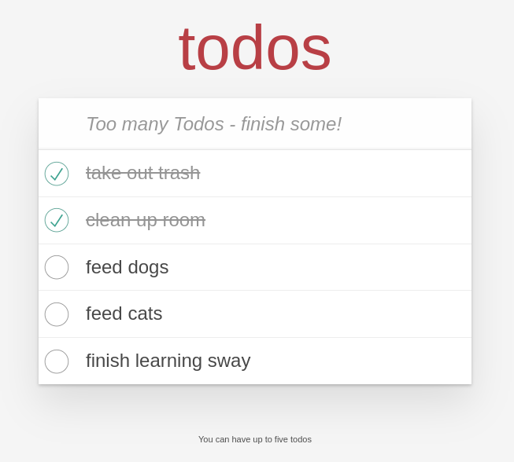

<div id="top"></div>

<div align="center">
  <a href="https://github.com/FuelLabs/sway-applications">
    
  </a>

  <h3 align="center">Sway Todo</h3>

  <p align="center">
    Sway Todo List Smart Contract with React and Fuel v2 TypeScript SDK
    <br />
    <a  href="https://fuellabs.github.io/fuels-ts/"><strong>Explore the Fuel TypeScript SDK docs »</strong></a>
  </p>
</div>

## Table of contents

- [About](#about)
- [Getting Started](#getting-started)
  - [Prerequisites](#prerequisites)
  - [Installation](#installation)
  - [How to run the application](#usage)
  - [Application Development Tutorial](#walkthrough)
    - [Creating the smart contract](#1-creating-a-deployable-sway-smart-contract)
    - [Compiling the contract, generating TypeScript and deploying](#2-compiling-your-sway-contract-generating-typescript-and-deploying)
      - Compiling the contract
      - Generating TypeScript
      - Deploying the contract
    - [Using the contract in a React project](#3-using-your-sway-contract-in-a-react-project)
- [Contributing](#contributing)
- [License](#license)

## About

In this tutorial, we create a Sway Contract that implements the basic structures needed for a typical todo list application. This shows how a Sway program can store structured variable data and interact with it on the Fuel VM at runtime and on a React web app via the [TypeScript SDK](https://fuellabs.github.io/fuels-ts/).

<p align="center">
  
</p>

<p align="right">(<a href="#top">back to top</a>)</p>

## Getting Started

We recommend that you first read through and understand the basics of [Sway](https://fuellabs.github.io/sway/latest/), the DSL for the Fuel Virtual Machine.

### Prerequisites

Your machine will need to have a few things installed in order to run a local fuel node and this React application:

- [The latest LTS version of Node.js](https://nodejs.org/)
- [The latest forc and fuel-core binaries](https://fuellabs.github.io/sway/latest/introduction/installation.html#dependencies)

### Installation

Open this demo application

```sh
cd tutorials/todo
```

Install NPM packages

```sh
npm i
```

### Usage

To quickly run this demo application, follow these steps, or see detailed tutorial below

Run React application in dev mode, make sure to configure a new [`.env`](./.env.example) file.

```sh
npm run dev
```

View in local browser

```sh
open http://localhost:3000
```

### Walkthrough

In this tutorial, we will complete the following tasks:

1. Creating a deployable Sway [Smart Contract](https://fuellabs.github.io/sway/latest/sway-program-types/smart_contracts.html) capable of more advanced features
2. Compiling your Sway contract, Generating TypeScript, and Deploying
3. Using your Sway contract in a React project

#### 1. Creating a deployable Sway Smart Contract

Our demo application uses a todo contract with methods for interacting with a stored todo list, read more about [contract storage here](https://fuellabs.github.io/sway/latest/blockchain-development/storage.html).

With Sway, we can organize our project into modules to encourage code reuse and separation of concerns, this is accomplished by using `library` flags.

In our library called [tasks.sw](src/tasks.sw) we can create the structure of an item in todo list, and call it a `Tasks:

```rust
library tasks;

struct Task {
    completed: bool,
    value: str[20],
}
```

Take a look at the following source from [data_structures.sw](src/data_structures.sw) for the program, which outlines the  interface needed to interact with a Todo list:

```rust
abi Todo {
    // returns back an array of 5 items, of type Task
    fn get_tasks() -> [Task; 5];
    // sets a new Task into array at index, with `completed` defaulted to `false`
    fn add_task(index: u64, value: str[20]);
    // toggles the Task property `completed` on Task at this index
    fn toggle_task(index: u64);
    // removes the Task at this index
    fn remove_task(index: u64);
}
```

Finally in the [main.sw](src/main.sw) program, we can import our library modules and use them:

```rust
dep abi;
dep tasks;

use std::storage::StorageMap;
use abi::Todo;
use tasks::Task;
```

The core of the Contract occurs here, where we implement the methods of the contract based on our previous [abi.sw](src/abi.sw) specifications.

```rust
impl Todo for Contract {

}
```

#### 2. Compiling your Sway contract, Generating TypeScript, and Deploying

Using the provided npm scripts, TypeScript bindings can be created using the Fuel TypeScript SDK.

```sh
npm run build
```

The generated TypeScript will be available in `src/todo-contract-types`.

Create and update `.env` file with relevant values, (see [.env.example](.env.example)):

```
GENESIS_SECRET="<YOUR SECRET>"
PRIVATE_KEY="<YOUR WALLET PRIVATE KEY>"
FUEL_PROVIDER_URL="<YOUR FUEL CORE URL>"
CONTRACT_ID="<YOUR CONTRACT ID>" # see below
```

For `CONTRACT_ID`, once you have your environment variables ready, run this command in your project folder to deploy your Sway contract to your local Fuel provider:

```sh
npm run deploy
```

This will output a new `CONTRACT_ID` to save inside your `.env`. With that, your Sway contract is compiled, deployed, and available via a TypeScript interface.

#### 3. Using your Sway contract in a React project

Your generated Sway TypeScript bindings should be available inside `src/todo-contract-types`, which have a Contract Factory. Import the Fuels Wallet class and contract factory:

```javascript
import { Wallet } from "fuels";
import { TodoContractAbi__factory as Factory } from "./todo-contract-types";
```

Create a new Wallet instance using your Wallet Private Key, connecting to your local Fuel Node:

```javascript
const wallet = new Wallet(
  process.env.PRIVATE_KEY,
  process.env.FUEL_PROVIDER_URL
);
```

Finally, connect to your contract via the Factory, to obtain an instance of the Contract that you can then interact with using the created methods:

```javascript
const contractInstance = Factory.connect(process.env.CONTRACT_ID, wallet);
```

The contract instance has access to all of Smart Contracts methods created earlier, here are the same methods available in JavaScript:

```javascript
let newValue = await contractInstance.submit.get_todos();
let newValue = await contractInstance.submit.add_todo(0, "take out trash");
let newValue = await contractInstance.submit.toggle_todo(1);
let newValue = await contractInstance.submit.remove_todo(1);
```

In a React app, we can leverage this method access just like any other function:

```javascript
import { Todo } from "~/todo-contract-types/TodoContractAbi";

const App = () => {
  const [todos, setTodos] = useState([]);
  useEffect(() => {
    contractInstance.submit.get_todos().then(setTodos);
  }, [setTodos]);

  return (
    <ul>
      {todos.map((todo) => (
        <li>{todo.value}</li>
      ))}
    </ul>
  );
};
```

To run the demo React application, see [usage](#usage).

<p align="right">(<a href="#top">back to top</a>)</p>

## Contributing

In order to contribute to this demo, please see the main [sway-applications](../../CONTRIBUTING.md) repo.

In order to contribute to the `Fuel TypeScript SDK`, please see the main [fuels-ts](https://github.com/FuelLabs/fuels-ts) monorepo.

## License

The primary license for `sway-applications` is `Apache 2.0`, see [LICENSE](../LICENSE).
